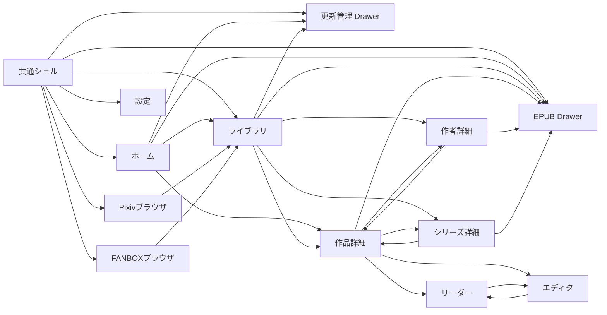

# piep フロントエンド現状監査・刷新ベースライン

調査日: 2026-08-02  
対象ブランチ: `develop`  
HEAD: `d75f50aad0265890d7912a5fe7c0cc0868dccff3`  
対象状態: 上記HEADに対する未コミットのフロント再構成を含む、現在の作業ツリー  
主対象: UI、UX、画面、ボタン、入力、画面遷移、状態遷移、副作用、Tauri外プレビュー、レスポンシブ、アクセシビリティ

## 0. この文書の位置づけ

この文書は、現行フロントを一新する前の仕様凍結用ベースラインです。

調査は次の3系統を照合して行いました。

1. 現在の `src/App.tsx`、サービス層、型、スタイルの静的解析
2. Vite開発ブラウザでの全公開画面、Drawer、Modal、コマンドパレット、最小幅レイアウトの操作確認
3. Tauriデスクトップ版でのライブラリ、Pixiv内蔵ブラウザ、設定、認証表示、実ウィンドウ幅での確認

作品データが0件だったため、作品詳細、リーダー、エディタ、作者詳細、シリーズ詳細のデータ入り表示はコード解析を主根拠としています。破壊的な削除、更新ジョブ開始、認証解除、バックアップ復元、再構築、ダウンロードは実行していません。

## 1. 結論

現行フロントはビルド可能で、Mantineベースの見た目は統一されています。一方で、旧コンポーネント群を `src/App.tsx` 1ファイルへ再統合した途中段階であり、「刷新済み完成版」というより、主要機能を一度簡略化して載せ直したプロトタイプに近い状態です。

特に重要な結論は次の通りです。

- `npm run build` は成功する。
- 画面ルーティングはURLや履歴ではなくReactローカルstateだけで行う。戻る・進む、深い画面への再訪、スクロール復元は失われている。
- ライブラリの `閲覧 / EPUB / 更新 / 削除` モードは別画面へ移動しても残り続ける。ライブラリに戻っただけでは閲覧モードへ戻らず、複数のサイドバー項目が同時に選択表示になる。
- Tauriの最小ウィンドウ幅900px、および標準に近い1200px幅で、Pixiv/FANBOXの保存候補パネルが画面下へ押し出され、全体スクロール禁止のため操作できない。
- Readerと作者/シリーズ詳細から「保存元」「元ページ」を開くと、対象URLを捨ててPixiv/FANBOXのトップページへ移動する。
- 作品詳細の更新確認、作者/シリーズ単位の新作取得・削除、更新候補の個別選択、EPUBの高度な圧縮設定など、旧UIにあった重要機能が現行UIから欠落している。
- Tauri外プレビューは「操作は無効」と説明するが、設定・更新・テンプレート管理の一部ボタンが有効で、押すと `invoke` 未定義の生エラーになる。
- クリック可能なカード、タグ、アイコンボタンの多くにキーボード操作やアクセシブルネームがない。
- `App.tsx` は3,133行、約132KB。ビルド後JSは約1.10MB、gzip約325KBで、Viteの大きなchunk警告が出る。
- 自動テストは見当たらない。

刷新は見た目から始めるより、先にルート、作業モード、選択状態、Tauri実行可否、非同期ジョブの状態モデルを分離する必要があります。

## 2. 技術構成

| 項目 | 現状 |
| --- | --- |
| デスクトップ | Tauri 2 |
| UI | React 19.2 + TypeScript 6 |
| ビルド | Vite 8 |
| コンポーネント | Mantine 9.3 |
| アイコン | lucide-react |
| サーバー状態 | TanStack React Query 5 |
| グラフ | Mantine Charts |
| ルーター | なし |
| フォーム | Mantine Form |
| 通知 | Mantine Notifications |
| Modal確認 | Mantine Modals |
| コマンドパレット | Mantine Spotlight |
| グローバル状態 | `App` の `useState`。`src/store.ts` はTauri設定ストアのみ |
| スタイル | Mantine標準 + `src/styles/app.css` |
| カラースキーム | OS追従 `defaultColorScheme="auto"`。手動切替なし |

React Queryの共通設定は、`staleTime=30秒`、`gcTime=5分`、ウィンドウフォーカス再取得なし、失敗時リトライ1回です。

## 3. 現在のフロント構造

削除予定または削除済み扱いの旧コンポーネント群に代わり、UI実装のほぼ全てが `src/App.tsx` にあります。

| ファイル | 現在の役割 |
| --- | --- |
| `src/App.tsx` | 全ルート、全画面、Drawer、Modal、主要ワークフロー |
| `src/styles/app.css` | シェル、カード、ブラウザ、リーダー、エディタの共通スタイル |
| `src/theme.ts` | Mantineテーマ |
| `src/main.tsx` | ProviderとグローバルCSS |
| `src/services/*` | Tauri invoke、ダイアログ、外部オープン、認証、DB、EPUB、更新ジョブ |
| `src/features/browser/downloadCandidates.ts` | URL判定、候補型、保存済みリンク解析 |
| `src/features/updates/updateJobs.ts` | 更新ジョブ用hook。ただし現行 `App.tsx` から未使用 |
| `src/features/updates/updateWorkflow.ts` | 旧更新ワークフロー。ただし現行 `App.tsx` から未使用 |

未使用の更新実装が残るため、同じドメインに「現在UIが使うcommand型更新ジョブ」と「未使用のフロント主導更新ワークフロー」が併存しています。

## 4. 画面・オーバーレイ一覧

### 4.1 メインルート

`AppRoute` は次の6系統です。

| route | 画面 | 備考 |
| --- | --- | --- |
| `home` | ホーム/作業台 | 初期画面 |
| `library` | ライブラリ | 内部に4つの作業モードを持つ |
| `browser + pixiv/fanbox` | 内蔵ブラウザ | 保存候補パネルを同一画面に常設 |
| `work + id + detail/reader/editor` | 作品詳細/リーダー/エディタ | データが必要 |
| `entity + person/series + source + key` | 作者/シリーズ詳細 | データが必要 |
| `settings` | 設定 | 認証、バックアップ、再構築 |

### 4.2 グローバルオーバーレイ

| オーバーレイ | 開き方 | 役割 |
| --- | --- | --- |
| Spotlight | ヘッダーボタン、Ctrl/Cmd+K、Ctrl/Cmd+P | 7つの主要画面/作業へ移動 |
| LOGS Drawer | ヘッダーの波形アイコン | Tauriイベントと保存処理ログ |
| EPUB Drawer | サイドバー、ライブラリ、作品詳細、エンティティ詳細 | 選択作品のEPUB出力 |
| 更新管理 Drawer | サイドバー、ライブラリ、ホーム | 更新対象とジョブ結果 |
| 検索フィルター Drawer | ライブラリのフィルターボタン | 詳細絞り込み |
| 読書設定 Drawer | リーダー | 読書表示設定 |
| テンプレート管理 Modal | EPUB Drawer | EPUBテンプレート編集 |
| 画像プレビュー Modal | 作品詳細 | 表紙・画像アセットの拡大 |
| 確認Modal | 削除、再構築、テンプレート削除 | 破壊操作の確認 |

### 4.3 遷移図

この図にはブラウザ履歴という概念がありません。実装上も `pushState`、`replaceState`、`popstate` は存在しません。

## 5. 共通シェル

### 5.1 ヘッダー

左側:

- グラデーションのSparklesアイコン
- `piep`
- 現在ルート名

右側:

- `コマンド Ctrl K`: Spotlightを開く
- 波形アイコン: LOGS Drawerを開閉
- Pixiv/FANBOX認証バッジ

認証バッジは接続済みなら色付き、未接続ならグレーです。画面幅が小さいと非表示になります。

LOGSボタンはTooltipでは「ログ」と表示されますが、ボタン自体に `aria-label` がなく、DOM上は無名ボタンです。

### 5.2 左ナビゲーション

上から次の順です。

1. ホーム
2. ライブラリ
3. Pixiv
4. FANBOX
5. EPUB作業
6. 更新管理
7. 設定

Pixiv/FANBOXは認証済みの場合、右端に `OK` バッジが出ます。

`EPUB作業` はライブラリへ移動し、ライブラリモードを `epub` にしてEPUB Drawerを開きます。`更新管理` も同様に `update` モードへ切り替えてDrawerを開きます。

### 5.3 サイドバー選択状態の問題

ライブラリルートでは常に `ライブラリ` がactiveです。同時に `workbenchMode=epub` なら `EPUB作業`、`workbenchMode=update` なら `更新管理` もactiveになります。

実画面で、次の同時選択を確認しました。

- `ライブラリ` と `EPUB作業`
- `ライブラリ` と `更新管理`

さらに、通常の `ライブラリ` ナビを押しても `workbenchMode` は `browse` に戻りません。削除モードを含む現在モードが画面遷移後も残ります。

### 5.4 Spotlight

ヘッダーボタン、Ctrl/Cmd+K、Ctrl/Cmd+Pで開きます。アクションは次の7件です。

- ホーム
- ライブラリ
- EPUB作業
- 更新管理
- Pixivブラウザ
- FANBOXブラウザ
- 設定

別途、Ctrl/Cmd+Lでライブラリへ移動します。ただし、これもライブラリ作業モードを閲覧へ戻しません。

### 5.5 LOGS

- 最大500件
- `download-log` Tauriイベント
- `search-index-progress` Tauriイベント
- ブラウザ候補取得/保存処理から明示的に送ったログ
- `クリア` で全消去

通常の `showNotice` エラーはLOGSへ同期されません。実際にTauri外でPixiv連携を押した際の生エラーは通知には出ましたが、LOGSは0件のままでした。

## 6. ホーム/作業台

### 6.1 表示内容

- タイトル `作業台`
- 説明 `保存、検索、読書、更新をひとつの流れで扱います。`
- 主要ボタン
  - 一覧で探す
  - EPUB
  - 更新
- メトリクス
  - 作品
  - お気に入り
  - 更新監視
  - 未インデックス
- 保存推移のAreaChart
- ソース内訳のDonutChart
- 人気タグ
- 作者
- 最近の保存

### 6.2 操作

| 操作 | 結果 |
| --- | --- |
| 一覧で探す | ライブラリへ。sourceをallへする |
| EPUB | ライブラリをepubモードにし、EPUB Drawerを開く |
| 更新 | ライブラリをupdateモードにし、更新Drawerを開く |
| 作品カード | ライブラリへ |
| お気に入りカード | source=favoriteでライブラリへ |
| 更新監視カード | 更新Drawerへ |
| 未インデックスカード | クリック不可 |
| 人気タグ | includeタグフィルターを追加してライブラリへ |
| 作者 | include作者フィルターを追加してライブラリへ |
| 最近の保存 | 作品詳細へ |

保存推移のグラフやソースのドーナツは表示専用で、期間やソース絞り込みへの操作導線はありません。

### 6.3 Tauri外

全て0件で表示され、黄色のプレビュー警告が出ます。ローディング中はメトリクスのみSkeletonです。

## 7. ライブラリ

ライブラリは検索条件、サブタブ、作業モード、EPUB選択を同じ画面に重ねる中心画面です。

### 7.1 保持状態

| 状態 | 初期値 |
| --- | --- |
| query | 空 |
| source | all |
| sortBy | published |
| sortOrder | desc |
| searchMode | smart |
| tagFilters | 空 |
| authorFilters | 空 |
| filterMode | and |
| minChars/maxChars | 空 |
| assetFilter | all |
| watchFilter | all |
| subTab | works |
| limit | 80 |

これらはAppが生きている間だけ保持されます。再起動、リロード、履歴復元には対応しません。

### 7.2 検索ボックス

- 250msデバウンスでライブラリ検索
- 候補は200msデバウンスで最大8件
- フォーカスで候補Dropdownを開く
- Enter/Escapeで閉じる
- クエリ入力時にsortByをrelevanceへ変更
- クエリを消してもsortByはrelevanceのまま
- 検索候補をクリックすると次のトークンを末尾に追加
  - `tag:"value"`
  - `author:"value"`
  - `series:value`
  - その他は引用句
- Dropdown内で検索モードを切替
  - smart
  - exact
  - semantic

入力欄に提示される構文は `tag:`、`author:`、除外 `-`、引用句です。旧UIにあった保存検索、最近の検索、意味検索の明示ボタン、構文ヘルプUIは現行にはありません。

Tauri外では検索入力だけdisabledですが、source、sort、filter、タブ、作業モードは操作可能です。

### 7.3 ソース

- すべて
- Pixiv
- FANBOX
- お気に入り

### 7.4 ソート

- 関連度
- 保存日
- 投稿日
- タイトル
- 作者
- サイズ

右隣の無名ActionIconで昇順/降順を切り替えます。降順は下矢印、昇順は右矢印で、昇順を示すアイコンとして分かりにくい状態です。

### 7.5 適用中フィルターチップ

- タグはinclude=indigo、exclude=red
- タグチップのXで次状態へ進める
- 作者はinclude=teal、exclude=red
- 作者チップには削除ボタンがない
- 検索インデックス未完了時は進捗Badge

タグのXは「即時削除」ではなく `include -> exclude -> 解除` の循環関数を呼ぶため、includeタグのXを押すと一度excludeになります。見た目の期待と動作が一致していません。

### 7.6 詳細フィルターDrawer

- 検索モード: Smart / Exact / Semantic
- タグ条件: AND / OR
- 最小文字数
- 最大文字数
- アセット
  - すべて
  - テキストのみ
  - 画像あり
  - その他ファイルあり
  - 画像+ファイル
- 更新確認
  - すべて
  - 更新ON
  - 更新OFF
- タグ候補検索
- 作者候補検索
- タグ/作者ボタンをクリックすると `未指定 -> include -> exclude -> 未指定`
- フィルターをクリア

クリア対象はquery、タグ、作者、文字数、アセット、更新確認です。source、sort、sortOrder、searchMode、filterMode、subTabは維持されます。

### 7.7 サブタブ

- 作品
- 作者
- シリーズ

作品タブは検索APIの結果を表示します。

作者/シリーズタブは検索結果ではなく、引数なしの `getFilterFacets()` から得たグローバルfacetを表示します。そのため、検索語、source、タグ、作者、文字数、アセット、更新条件とカード一覧が一致しない可能性があります。上部件数は検索API由来、カードはグローバルfacet由来なので、件数と表示カードの文脈もずれます。

### 7.8 作業モード

| モード | カードクリック | 追加UI |
| --- | --- | --- |
| 閲覧 | 作品詳細へ | なし |
| EPUB | EPUBキュー選択をtoggle | `キュー` ボタン |
| 更新 | 作品のwatchUpdatesをtoggle | 表示中を更新ON/OFF、`管理` |
| 削除 | その作品の削除確認を即表示 | 絞り込み結果を削除 |

重要事項:

- モードはルートを跨いで残る。
- `ホーム -> ライブラリ`、サイドバーの `ライブラリ`、Ctrl/Cmd+Lでもbrowseへ戻らない。
- EPUB選択はmodeを変えても残り、カードの選択枠と `選択中` Badgeも残る。
- 削除モードは選択蓄積方式ではなく、カードを押すたび1件削除確認になる。
- 作者/シリーズタブでは作業モードの意味がカードに適用されず、常にエンティティ詳細を開く。

### 7.9 一括更新監視

更新モードの次の2ボタンは、画面にロード済みの80件だけではなく、現在の検索条件に一致する最大200,000件を対象にします。

- 表示中を更新ON
- 表示中を更新OFF

ラベルの「表示中」と実際の対象範囲が一致していません。

### 7.10 一括削除

`絞り込み結果を削除` は現在の検索条件に一致する最大200,000件を完全削除します。確認Modalはありますが、対象件数をModal内に表示しません。

### 7.11 作品カード

表示:

- 表紙
- お気に入りActionIcon
- 更新監視ActionIcon
- source Badge
- EPUB選択Badge
- タイトル
- 作者ボタン
- シリーズボタン
- 投稿日、文字数、サイズ
- 最大5タグ
- 6件目以降は `+n` Tooltip
- 検索ハイライト

操作:

- カード本体: 現在作業モードに依存
- 星: お気に入りtoggle
- 更新アイコン: 更新監視toggle
- 作者名: 作者詳細
- シリーズ: シリーズ詳細
- タグ: include/exclude/解除を循環

星、更新アイコンにはアクセシブルネームがありません。カード自体はbutton/linkではなく、Enter/Space操作もありません。タグBadgeも同様です。

### 7.12 作者/シリーズfacetカード

- source
- 件数
- 名前
- 説明またはサンプルタイトル
- 更新日時
- クリックで詳細

これも通常のCardにonClickを付けた構造で、キーボード操作不可です。

### 7.13 読み込みと空状態

- 初回ローディング: 8枚のSkeleton
- 手動 `さらに読み込む`: limitを80ずつ増やし、先頭から再取得
- 仮想化なし
- 空結果専用メッセージなし
- APIエラー専用表示や再試行ボタンなし

## 8. Pixiv/FANBOX内蔵ブラウザ

### 8.1 共通構成

上部Toolbar:

- 戻る
- 進む
- 再読み込み
- URL入力
- 未連携ボタン
- 候補を取得/更新

本文:

- 左または上: 内蔵ブラウザ
- 右または下: 保存候補

### 8.2 初期URL

- Pixiv: `https://www.pixiv.net/`
- FANBOX: `https://www.fanbox.cc/`

source切替時にURL、アドレス欄をトップへ戻します。

### 8.3 URL同期と内蔵ブラウザ寿命

- 1.5秒ごとに現在URLを取得
- URLが変わるとReact stateを更新
- `openBrowser` effectが `currentUrl` に依存
- cleanupで内蔵ブラウザを閉じる

この依存関係により、URL変化を検知するたび内蔵ブラウザを閉じて同じURLで開き直す構造です。履歴がリセットされ、戻る/進むが不安定になる可能性が高いです。

ウィンドウresizeを監視する `ResizeObserver` やresize listenerはなく、埋め込み領域のbounds再計算もありません。ウィンドウサイズ変更後にネイティブWebViewとReact側の枠がずれる可能性があります。

### 8.4 対応URL

| 種別 | 判定例 |
| --- | --- |
| Pixiv単一小説 | `/novels/{id}`、`/novel/show.php?id={id}` |
| Pixivシリーズ | `/novel/series/{id}`、`/novel/series/show.php?id={id}` |
| Pixivユーザー | `/users/{id}`。URLに `/novels/` があれば除外 |
| FANBOX単一投稿 | `/posts/{id}` |
| FANBOXクリエイター | `{creator}.fanbox.cc`、`fanbox.cc/@{creator}` |

### 8.5 候補取得

1. 現在URLを判定
2. 未対応ならエラー通知
3. 候補一覧と進捗をクリア
4. 保存済みcredentialを読む
5. 種別ごとのAPIを呼ぶ
6. 全件selectedで候補化
7. 件数を通知とLOGSへ出す

認証未接続でも候補取得ボタン自体はdisabledになりません。未連携ボタンが並ぶだけで、候補取得を押すと空credentialでAPIを呼び、APIエラーになります。

別URLへ移動しても前回候補は表示されたままで、現在URLと候補の対応を示す表示がありません。新しい候補取得を押すと前回候補を先に消し、取得失敗時の復元はありません。

### 8.6 候補操作

- ライブラリ
- 全選択
- 全解除
- 各行Checkbox
- 選択したn件を保存
- 成功が1件以上なら保存後のライブラリへ

候補Cardにはcursorが付いていますが、Card本体クリックでは選択できません。Checkboxだけが操作対象です。

状態ラベルは英語の内部値をそのまま表示します。

- downloading
- success
- skipped
- failed

### 8.7 保存処理

- 選択候補を直列処理
- 既存作品か確認
- 既存かつwatchUpdates=falseならskipped
- 既存かつwatchUpdates=trueなら再取得・保存
- 新規なら取得・保存
- 作者/シリーズprofile更新を非同期ベストエフォートで実行
- 最後に保存/スキップ/失敗件数を通知

進捗stateは `current / total / text` を持ちますが、UIはProgress barだけで、現在件数や処理中タイトルを表示しません。

保存後にライブラリやダッシュボードのReact Query cacheをinvalidateしません。30秒のstaleTime中は保存後のライブラリが古い可能性があります。

保存中の画面遷移ガードもありません。別画面へ移動するとBrowserDeskがunmountされ、内蔵ブラウザも閉じますが、開始済みの非同期保存ループは残る可能性があります。

### 8.8 致命的なレイアウト問題

Mantineの `xl` 未満ではブラウザ領域と保存候補が縦積みになります。一方で:

- `body { overflow: hidden }`
- `.browser-desk` は固定高
- browser gridに内部スクロールなし
- 保存候補はブラウザ領域の下へ配置

となっています。

実測:

| viewport | ブラウザ領域y | 保存候補y | body高さ | viewport高さ | 結果 |
| --- | ---: | ---: | ---: | ---: | --- |
| 900x600 | 115 | 620 | 1109 | 600 | 候補欄へ到達不能 |
| 1280x720 | 115 | 740 | 1349 | 720 | 候補欄へ到達不能 |

Tauri設定は初期幅1200、最小幅900なので、通常のデスクトップ利用範囲そのものがこの問題に該当します。Tauri実画面でも保存候補が見えないことを確認しました。

## 9. 作品詳細

### 9.1 データ取得

- 作品メタデータ
- アセット
- バージョン一覧
- 指定バージョンHTML

Tauri外では警告だけを表示します。

### 9.2 ヒーロー領域

- 戻る
- 表紙。クリックでプレビューModal
- source
- お気に入り表示
- 更新ON表示
- タイトル
- 作者
- シリーズ
- 折りたたみ説明文
- タグ
- 操作Menu

お気に入り、更新ONは表示Badgeだけで、この画面からtoggleできません。

### 9.3 操作Menu

| 項目 | 動作 |
| --- | --- |
| 読む | Readerへ |
| 編集 | Editorへ |
| EPUBに追加/選択解除 | グローバルEPUBキューをtoggleし、Drawerを開く |
| 保存元を開く | OS既定ブラウザで外部URLを開く |
| フォルダを開く | JSONパスをファイルマネージャで表示 |
| 単体エクスポート | 出力先フォルダを選んでexportSingle |
| 削除 | 複数versionなら閲覧version、1versionなら作品全体を削除 |

作品単体の更新確認ボタンは現行UIにありません。

削除対象versionの選択UIは本文タブ内にある一方、削除Menuは画面上部にあります。ユーザーは現在どのversionが削除対象か把握しにくい構造です。

### 9.4 タブ

#### 概要

- ソースID
- 種類
- 本文文字数
- アセット件数/サイズ
- 保存日
- 投稿日
- 更新日
- 現在version
- 閲覧version

#### 本文

- version選択
- `保存元/内部リンクを開く`
- HTML本文を `dangerouslySetInnerHTML` で表示

`保存元/内部リンクを開く` は保存済みURLならDB内作品詳細へ、それ以外はOS既定ブラウザへ送ります。ただし本文HTML内の各リンクにはクリックinterceptがなく、この処理は適用されません。

本文タブにページ分割や読書設定はありません。

#### アセット

- 画像をグリッド表示
- 画像クリックでプレビュー
- ファイル名、MIME/種別、サイズ
- 開く

#### JSON

- JSONパス
- 読込
- 読込後にCodeHighlight

未読込時のJsonInputは空のcontrolled inputで、編集して保存する機能はありません。

#### 差分

- Before version
- After version
- 追加行数
- 削除行数
- 最大120行ずつ表示

差分はHTMLをプレーンテキスト化し、行が相手側配列に存在するかだけで比較します。順序変更、同一行の重複、部分変更を正しく表現するdiffではありません。

### 9.5 遷移上の制限

- 戻るは常にライブラリ。ホームの最近の保存や作者詳細から来ても元画面へ戻らない。
- ブラウザ履歴に積まれない。
- ライブラリのスクロール位置も復元されない。

## 10. リーダー

### 10.1 基本操作

- 戻る: 作品詳細
- 保存元: Pixiv/FANBOXブラウザへ
- 編集: Editorへ
- 読書設定: 右Drawer

ReaderはAppShellの中にあるため、共通ヘッダーと左サイドバーは残ります。完全な没入型表示ではありません。

### 10.2 読書設定

- 標準に戻す
- 文字サイズ: 14-28
- 行間: 1.3-2.4
- テーマ: 紙/白/黒
- 書体: 明朝/ゴシック
- 読み幅: 狭め/標準/広め
- 先頭へ

設定は `piep.reader.*` のlocalStorageへ自動保存します。スクロール位置は作品IDごとに `piep.reader.scroll.{id}` へ保存します。

進捗率表示、残り時間、章ナビゲーション、version選択はありません。

`先頭へ` のアイコンは下矢印で、動作と逆向きです。

### 10.3 保存元遷移の不具合

Readerは保存元URLを親へ渡しますが、親側はURLをrouteへ保持せず、sourceだけを見てPixiv/FANBOX画面へ移動します。結果、対象作品ではなく各サービスのトップページが開きます。

## 11. エディタ

### 11.1 画面構成

- 戻る
- タイトル
- base version
- active revision有無
- 読む
- 下書き保存
- 有効化
- ブロック一覧
- 末尾追加ボタン

### 11.2 ブロック種別

- 段落
- 見出し
- 画像
- 区切り

各ブロック:

- 種別変更
- 上へ
- 下へ
- 削除。最低1ブロックは残す
- 段落/見出しはTextarea
- 画像は既存画像アセットSelect
- 区切りはDivider

末尾へ追加:

- 段落
- 見出し
- 挿絵。ファイル選択後にアセット取込
- 区切り

### 11.3 保存モデル

- 下書き保存: `saveWorkDraft`
- 有効化: 下書きを保存してから `activateWorkEdit`
- 保存後にEditor、Reader、WorkのQueryをinvalidate

### 11.4 UX上の不足

- dirty表示なし
- 画面離脱時の未保存確認なし
- 保存中disabled/loadingなし
- 二重送信防止なし
- 内容validationなし
- undo/redoなし
- ドラッグ並べ替えなし
- 画像プレビューなし
- 自動保存なし
- block数が多い場合の仮想化なし

## 12. 作者/シリーズ詳細

### 12.1 データ取得

- entity本体
- 最新profile JSON
- profile履歴
- 最大120作品

シリーズはseries_order昇順、作者はpublished降順です。

loading skeletonやAPI error表示はなく、取得中でもsourceKeyをタイトル代わりにした空画面が先に出ます。

### 12.2 表示

- 戻る
- カバー/アイコン
- source
- 作者/シリーズ種別
- 名前
- 説明
- 読み込み済み作品数
- profile履歴数
- 最終確認日時
- 作品カード

### 12.3 操作

| ボタン | 現行動作 |
| --- | --- |
| 元ページ | Pixiv/FANBOX Browser routeへsourceだけ渡す |
| 更新 | profileをforce refresh |
| バックアップ | ZIP保存先を選びentity単位export |
| EPUB | 現在ロード済み最大120作品でEPUBキューを置換しDrawerを開く |

### 12.4 問題

- 元ページURLをrouteが保持しないためトップページが開く。
- シリーズでもPixiv URLを `/users/{sourceKey}` として組み立てるためURL自体が誤っている。
- `更新` はprofile refreshだけで、新作取得ジョブではない。
- 更新後にentity queryをinvalidateしないため表示が更新されない。
- 120件を超える作品を読み込めない。
- entity内の削除、更新監視管理、個別EPUB選択がない。
- 作品カードの作者ボタンはno-op。
- 作品カードのタグはno-opだが、見た目は通常ライブラリと同じクリック可能Badge。
- お気に入り/更新監視アイコンはDB更新するが、onChangedがno-opなので表示が更新されない。
- シリーズボタンだけはシリーズ詳細へ遷移する。

## 13. EPUB作業

### 13.1 キュー

選択状態はApp全体の `selectedIds` と `selectedItems` で保持されます。

- ライブラリepubモード: 作品を個別toggle
- 作品詳細: 個別toggle
- 作者/シリーズ詳細: 現在の最大120作品でキュー全体を置換
- クリア: 全解除

Drawerを閉じても選択は残ります。browse/update/deleteモードへ移ってもカードの選択表示が残ります。

### 13.2 基本設定

- テンプレート
  - 自動判別
  - 登録済みテンプレート
- 画像圧縮ON/OFF
- 圧縮設定Accordion
  - JPEG品質 40-100。初期82
  - WebP品質 40-100。初期82
  - PNG圧縮 0-6。初期4
  - 最大幅。初期1600
  - 最大高さ。初期2400
  - 出力形式: 元/JPEG/PNG/WebP
  - プログレッシブJPEG
  - WebPロスレス

画像圧縮OFFでもAccordion自体は操作可能で、値は保持されるものの出力時に無視されます。

SliderはDOM上でアクセシブルネームを持たず、3本とも単なる `slider` として露出します。

### 13.3 出力

- 1件: EPUBファイル保存ダイアログ
- 2件以上: 出力先フォルダ選択、batch export
- progress eventをAlertとProgressで表示
- 成功通知、失敗通知

出力中loading、ボタンdisabled、二重起動防止はありません。前回progressを新規出力前にclearしません。

### 13.4 テンプレート管理

- テンプレート一覧
- 新規テンプレート名
- Enterで作成
- ファイル一覧
- ファイル読込
- Textarea編集
- 保存
- テンプレート削除確認

問題:

- 新規作成の明示ボタンがなく、Enterだけ。
- built-in/readonly情報をUI制御に使っていない。
- built-inも削除ボタンが出る。
- readonlyファイルも編集/保存できる見た目。
- 編集中の未保存確認なし。
- Tauri外でもQueryを実行し、失敗を画面に出さないため空白Modalになる。

旧UIにあったJPEG/PNG/WebPの高度な詳細設定は現行UIから削除されています。

## 14. 更新管理

### 14.1 開始操作

- すべてチェック: scope=all、mode=check_only
- 自動保存込み: scope=all、mode=auto_save

両ボタンはTauri外でもenabledです。

### 14.2 active job

- 非terminalな先頭job
- なければjob一覧の先頭
- job選択UIはない
- 過去job履歴を任意に選べない

一覧は2秒、snapshotは1.5秒ごとにpollします。加えてTauri eventでsnapshotを更新します。

### 14.3 job表示

- scope/mode
- active label/status
- status Badge
- progress
- processed/totals
- candidate数
- saved数
- error数
- running/queued: 停止
- paused/auth_required/failed: 再開
- 非terminal: キャンセル
- 常時: クリア
- snapshotログ先頭1件

UIラベルには `scope`、`mode`、`status` の英語内部値がそのまま出ます。

### 14.4 タブ

- 作品
- 著者
- シリーズ
- 結果

作品/著者/シリーズ:

- 登録済み対象の名前、source、key、最終確認
- ON/OFF
- 停止/再開

現行UIには対象追加、対象削除、候補からの追加がありません。

### 14.5 結果

- 候補件数
- 候補Card
- status
- 選択候補を保存
- ログ

候補CardにCheckboxや選択toggleがありません。それでもボタン名は `選択候補を保存` です。保存処理は、backend snapshotで `selected=true`、またはstatusがfailed/candidateの全候補を自動抽出します。ユーザーが画面上で選択を変更できません。

候補保存後や更新job完了後にライブラリ/ダッシュボードqueryをinvalidateしません。

## 15. 設定

### 15.1 認証

Pixiv:

- 起動時に保存refresh tokenを検証
- 未接続: `Pixiv と連携を開始`
- 接続済み: 名前/ID、CONNECTED、`連携を解除`
- login webview成功後、tokenをstoreへ保存

FANBOX:

- 起動時にsession id/user agentを検証
- 未接続: `FANBOX と連携を開始`
- 接続済み: 名前/ID、CONNECTED、`連携を解除`
- login webview成功後、session id/user agentをstoreへ保存

認証変化後はauth queryとdashboardを更新します。

連携解除は確認Modalなしでcredentialを空文字へ置き換えます。

### 15.2 ローカルライブラリ

- バックアップ作成
  - ZIP保存先
  - 全データexport
- 復元
  - ZIP選択
  - import件数通知
- 再構築
  - 確認Modal
  - downloadsフォルダからDB/検索index再構築

復元と再構築後にlibrary、dashboard、facet、search-index queryをinvalidateしません。現在画面の表示が古いまま残る可能性があります。

バックアップ/復元にはbusy表示や二重起動防止がありません。再構築だけloadingがあります。

### 15.3 Tauri外の矛盾

画面上部は「ローカルDB、ファイル操作、内蔵ブラウザは無効」と説明しますが、次のボタンはenabledです。

- Pixiv/FANBOX連携
- バックアップ作成
- 復元
- 再構築
- 更新job開始
- テンプレート管理の一部操作

Pixiv連携を実際に押すと、`TypeError: Cannot read properties of undefined (reading 'invoke')` が通知にそのまま表示されました。

## 16. 画面遷移の完全表

| 起点 | 操作 | 遷移先/状態 |
| --- | --- | --- |
| 任意 | サイドバーHome | home |
| 任意 | サイドバーLibrary | library。mode維持 |
| 任意 | Pixiv/FANBOX | browser。各トップURL |
| 任意 | EPUB作業 | library + mode=epub + EPUB Drawer |
| 任意 | 更新管理 | library + mode=update + Update Drawer |
| 任意 | 設定 | settings |
| 任意 | Ctrl/Cmd+K/P | Spotlight |
| 任意 | Ctrl/Cmd+L | library。mode維持 |
| Home | 一覧/作品 | library |
| Home | お気に入り | library + favorite source |
| Home | EPUB | library + epub + Drawer |
| Home | 更新 | library + update + Drawer |
| Home | タグ/作者 | library + include filter |
| Home | 最近の保存 | work detail |
| Library browse | WorkCard | work detail |
| Library epub | WorkCard | EPUB選択toggle |
| Library update | WorkCard | watch toggle |
| Library delete | WorkCard | 1件削除確認 |
| Library | 作者/シリーズ | entity detail |
| Work detail | Back | library |
| Work detail | Read | reader |
| Work detail | Edit | editor |
| Work detail | 作者/シリーズ | entity detail |
| Work detail | タグ | library + include tag |
| Work detail | EPUB | queue toggle + Drawer |
| Reader | Back | work detail |
| Reader | Edit | editor |
| Reader | 保存元 | browserトップ。対象URL喪失 |
| Editor | Back | work detail |
| Editor | Read | reader |
| Entity | Back | library |
| Entity | WorkCard | work detail |
| Entity | シリーズ | series detail |
| Entity | 元ページ | browserトップ。対象URL喪失 |
| Entity | EPUB | queueをentity作品で置換 + Drawer |
| Browser | Library | library。mode維持 |
| Browser | 未連携 | settings |
| Browser | 保存後のライブラリ | library。cache未更新の可能性 |

## 17. 状態管理と副作用

### 17.1 Appローカルstate

- route
- library UI model
- workbench mode
- EPUB selected IDs/items
- EPUB Drawer open
- Update Drawer open
- LOGS Drawer open
- LOGS最大500件

route、library UI、mode、EPUB queueは永続化されません。

### 17.2 画面ローカルstate

- Browser候補、URL、保存進捗
- Work詳細version、JSON、lightbox
- Reader設定とDrawer
- Editor form
- Entity query
- EPUB設定、progress、template Modal
- Update active snapshot
- Settings busy

### 17.3 navigation guard

次の未完了作業に対する離脱guardはありません。

- Browser保存中
- Editor未保存変更
- EPUB export中
- Backup/restore中
- Update job実行中。job自体はbackendで続くが画面上の文脈は失う

### 17.4 cache invalidationの不足

不足が目立つ箇所:

- Browser保存後
- Update candidate保存後
- Update job完了後
- Entity profile更新後
- Entity内favorite/watch変更後
- Backup復元後
- Library再構築後

## 18. UI/UX評価

### 18.1 良い点

- Mantine採用でButton、Card、Drawer、Modalの見た目は統一されている。
- ホーム、ライブラリ、保存、EPUB、更新、設定という主要領域は常設ナビから到達できる。
- Spotlightで主要機能へ素早く移動できる。
- ライブラリの検索条件自体はsource、sort、タグ、作者、文字数、asset、watchまで広い。
- タグ/作者のinclude/exclude 3状態は強力。
- 危険な作品削除、bulk削除、version削除、再構築、template削除には確認Modalがある。
- Reader設定とスクロール位置が保存される。
- EPUB単一/複数で保存先UIを変える設計は適切。
- 更新jobは停止、再開、キャンセル、進捗、ログを持つ。
- Tauri外でプレビュー警告を出す方針自体は良い。

### 18.2 情報設計上の問題

- Libraryという1画面に閲覧、EPUB選択、更新監視、削除を重ね、カードクリックの意味が大きく変わる。
- 現在modeがルートを跨いで残るため、戻ってきた利用者が作業モードを誤認しやすい。
- Drawerを閉じても作業modeが残り、サイドバーは複数activeになる。
- Update管理とLibrary update modeの責務が分散している。
- EPUBもLibrary modeとDrawerに責務が分散している。
- 作品詳細、本文タブ、Readerの「読む」体験の役割差が明示されていない。

### 18.3 フィードバック不足

- API errorの専用状態がほぼない。
- raw error文字列を通知する。
- 保存、export、backup、復元、profile更新にloading/disabledが不足。
- Browser進捗は割合だけで、件数/タイトルを表示しない。
- 空状態が単なる余白になる画面が多い。
- 成功後のcache更新不足で、操作結果がすぐ見えない。

### 18.4 一貫性の問題

- `著者` と `作者` が混在。
- `CONNECTED / DISCONNECTED / smart / exact / semantic / downloading` など英語内部値が日本語UIへ露出。
- 昇順が右矢印、先頭へが下矢印。
- タグBadgeのXが削除ではなくincludeからexcludeへの遷移。
- `表示中を更新ON/OFF` が実際には検索条件全体を対象にする。
- `選択候補を保存` に選択UIがない。
- `更新` がEntityではprofile更新、Libraryではwatch toggle、Drawerではjob実行を意味する。

## 19. アクセシビリティ

### 19.1 確認できた問題

- ヘッダーLOGSボタンが無名。
- sort order ActionIconが無名。
- Browserの戻る/進む/再読み込みが無名。
- WorkCardのfavorite/watch ActionIconが無名。
- Editorの上下/削除ActionIconが無名。
- Back ActionIconの多くが無名。
- EPUBの3本のSliderが無名。
- クリック可能Cardがbutton/link roleを持たない。
- タグBadgeがキーボード操作できない。
- Entity Cardがキーボード操作できない。
- 画像preview対象にbutton roleや説明がない。
- アイコンだけの操作にTooltipがない箇所が多い。

### 19.2 キーボード

- Spotlightは良好。
- SearchはEnter/Escape対応。
- Drawer/ModalはMantineのfocus trap/ESC closeに乗る。
- カード、タグ、cover操作はキーボード不可。
- Browser候補CardはCheckboxだけ操作可能。

## 20. レスポンシブ・レイアウト

### 20.1 Tauriの許容サイズ

- 初期: 1200x800
- 最小: 900x600

### 20.2 900px幅

- 左ナビ264pxのためmainは約636px。
- Library toolbarは大きく折返し、右側のtab/mode群が密集する。
- 横方向にはみ出す要素がある。
- Browser保存候補は下へ押し出され到達不能。

### 20.3 1200-1280px幅

- Home/Settingsは概ね整う。
- BrowserはMantine `xl` 未満のため保存候補が下へ押し出され到達不能。
- Libraryは表示できるが、検索、source、sort、filter、subtab、modeの2段構成が高密度。

### 20.4 600px検証

TauriのminWidth未満ですが、Webプレビューで確認しました。Navbarが画面全体を占有し、開閉Burgerがないためmainを見られません。将来モバイルや狭幅対応を行う場合はShell設計から変更が必要です。

## 21. パフォーマンス・保守性

### 21.1 ビルド結果

`npm run build` 成功。

| artifact | size | gzip |
| --- | ---: | ---: |
| CSS | 約242KB | 約35.9KB |
| JS | 約1,098KB | 約325.5KB |

500KB超chunk警告あり。dynamic import/code splittingなし。

### 21.2 実行上の負荷

- Browser URL poll: 1.5秒
- Update job list poll: 2秒
- Update snapshot poll: 1.5秒
- Search index未完了poll: 2秒
- Libraryはlimit増加のたび先頭から全件再取得/再描画
- Work/Entity/Update候補は仮想化なし
- Charts、CodeHighlight、Spotlight、全画面を単一bundleへ含む

### 21.3 保守性

- `App.tsx` 3,133行
- 画面とドメイン処理が同一ファイル
- `Record<string, any>` をEntityで使用
- route、mode、selection、Drawer状態が密結合
- 未使用の旧更新hook/workflowが残る
- 自動テストなし
- データなし環境では作品系画面の回帰を検出できない

## 22. 旧調査時点から現行で欠落・縮小した機能

リポジトリ内の2026-06-06調査メモと現在コードを比較した結果です。

### 22.1 全体

- ブラウザ履歴連携
- 戻る/進むでの画面復元
- ライブラリスクロール位置復元
- ダウンロード中の画面遷移ガード

### 22.2 ホーム

- 容量メトリクス
- ソース/グラフからの絞り込み導線
- 連携確認ショートカット

### 22.3 ライブラリ

- ギャラリー/コンパクト表示切替
- 仮想グリッド
- 保存検索
- 最近の検索
- 意味検索の明示導線
- 文字数preset
- 適用中の全条件チップ
- 削除選択モード、全選択/全解除
- Backup dropdown

### 22.4 作品詳細

- 作品単体の更新確認
- 詳細上でのfavorite/watch toggle
- 本文ページ分割
- 本文タブの読書設定
- raw/processed JSON切替
- 本文リンクの保存済み作品解決
- 未保存リンクを内蔵ブラウザへ送る導線

### 22.5 作者/シリーズ

- 新作取得を含む更新チェック
- 削除モード
- 全選択/全解除
- 個別EPUB選択
- 表示切替
- さらに読み込む

### 22.6 EPUB

- JPEG高度設定
- PNG高度設定
- WebP高度設定
- 自動判別group preview
- built-in readonly制御

### 22.7 更新管理

- 更新対象の追加
- 更新対象の削除
- 追加候補一覧
- 表示中scopeだけjob開始
- 候補の個別選択
- 全選択/全解除
- 仮想リスト

### 22.8 設定

- 連携解除確認
- 復元/再構築後の明示再取得

これらは「刷新時に不要と決めた機能」なのか「移植漏れ」なのか、実装前にプロダクト判断が必要です。

## 23. 優先度付き問題一覧

### P0: 実作業を止める

1. 900-1280px幅でBrowser保存候補が到達不能。
2. Reader/Entityから元ページへ移動すると対象URLを失う。
3. workbench modeが画面遷移後も残り、Libraryへ戻ってもbrowseにならない。delete/updateの誤操作につながる。
4. Entityのシリーズ元URLがPixiv user URLになる。

### P1: 機能欠落または重大な誤解

1. 作品単体更新確認がない。
2. Entity更新がprofileだけで新作取得にならない。
3. Update候補の選択UIがない。
4. 作者/シリーズタブが検索/フィルター文脈を無視する。
5. Entityの作者/タグボタンが見た目だけで動かない。
6. 保存/更新/復元後のcache invalidation不足。
7. Browser URL変更ごとにnative browserを閉じて開き直す。
8. Browser resizeでboundsを再計算しない。
9. Tauri外で無効のはずの操作がenabledで、生のinvoke errorになる。
10. 未保存Editor離脱確認がない。

### P2: UX品質

1. 履歴、戻る、スクロール復元がない。
2. 複数ナビ項目が同時active。
3. 一括操作ラベルと対象範囲が不一致。
4. loading/disabled/empty/error state不足。
5. 英語内部値の露出。
6. ActionIconのaccessible name不足。
7. Card/Badgeのキーボード操作不可。
8. EPUB export二重起動防止なし。
9. Backup/restore二重起動防止なし。
10. Diffが簡易集合比較。

### P3: 保守性/将来性

1. 3,133行の単一Appファイル。
2. 1.10MBの単一JS bundle。
3. 未使用更新実装の併存。
4. 自動テストなし。
5. 手動ダーク/ライト切替なし。
6. 最小幅未満ではNavbarを閉じられない。

## 24. 刷新時に必ず仕様として決める項目

### 24.1 ナビゲーション

- URL/routeでどこまで表現するか
- Browser back/forwardをアプリ履歴に使うか
- Work/Entity/Reader/Editorの戻り先
- スクロール位置をどの単位で復元するか
- Drawerをroute化するか、局所stateにするか

### 24.2 作業モード

- browse/epub/update/deleteを同じカードへ重ねるか
- modeを画面遷移時に解除するか
- deleteを選択式に戻すか
- EPUB queueを永続的な作業トレイにするか
- Update監視toggleとUpdate job管理を分けるか

### 24.3 保存ワークフロー

- 候補パネルの位置とresize時の挙動
- 保存中の離脱可否
- 既存+watch offをskipする仕様を維持するか
- current URLと候補の対応表示
- 保存後cache更新

### 24.4 作品

- version選択を画面全体へ適用するか
- update、favorite、watchの主要操作位置
- 本文タブとReaderの役割分担
- 本文内リンクの解決方針
- JSON/diffを一般ユーザーへ見せるか、詳細ツールへ分けるか

### 24.5 Entity

- profile更新と新作取得を同じ操作にするか
- 作者/シリーズ単位のdelete/export/update/EPUBを維持するか
- 120件制限とpagination
- 作者/シリーズfacetをLibrary検索条件へ従属させるか

### 24.6 EPUB

- 高度な圧縮設定を維持するか
- template管理を通常設定へ移すか
- batch出力の命名/競合ルール
- export中の進捗、取消、再試行

### 24.7 Update

- job履歴を残すか
- candidateを必ずユーザー選択させるか
- auto_saveの確認レベル
- target追加/削除UI
- source別認証切れの復旧導線

## 25. 推奨する刷新後の情報設計

現行機能を保ちながら認知負荷を下げる案です。

### 25.1 トップレベル

1. ホーム
2. ライブラリ
3. 保存
4. 更新
5. EPUB/エクスポート
6. 設定

Pixiv/FANBOXは「保存」配下のsource tabにまとめられます。EPUBと更新はDrawerだけにせず、それぞれ独立workspaceとし、選択トレイだけを共通化します。

### 25.2 ライブラリ

- 通常閲覧を既定かつ安全な状態に固定
- bulk selectionは明示的に開始/終了
- deleteは独立した選択モードと固定action bar
- favorite/watchはカードのsecondary action
- 作者/シリーズは検索条件に従うprojectionとして扱う
- view、query、filter、sort、scrollをroute/storeへ保存

### 25.3 Work

- 詳細
- 読む
- 編集
- 履歴/差分
- 技術情報/JSON

これらを同じ作品route配下へ置き、versionと戻り先をroute stateへ含めます。

### 25.4 非同期作業

Download、Update、EPUB、Backupを共通Jobモデルで扱い、次を統一します。

- running/success/error/canceled
- progress
- current item
- cancel/retry
- navigation guard
- notification
- logs
- cache invalidation

## 26. 推奨実装順

### Phase 0: 仕様凍結

- この文書の「欠落機能」を維持/廃止/再設計に分類
- 破壊操作と自動保存の確認レベルを決定
- routeと作業modeの状態遷移表を確定

### Phase 1: 基盤

- React Routerまたは同等の明示route層
- Shell、route、workspace state、selection state、job stateを分離
- Tauri runtime capability layer
- Query key/invalidation policy
- Error boundary

### Phase 2: 安全性

- Browser保存候補レイアウト修正
- URL引き渡し修正
- mode離脱/復帰ルール
- unsaved/navigation guard
- destructive actionの共通確認
- disabled/loading/double-submit防止

### Phase 3: 主要画面

- Library
- Save Browser
- Work Detail/Reader/Editor
- Entity
- Update
- EPUB
- Settings

### Phase 4: 品質

- keyboard/focus/ARIA
- 900/1200/1440pxのvisual regression
- component test
- route/state transition test
- Tauri integration test
- code splittingとvirtualization

## 27. 刷新受け入れ条件

最低限、次を満たしてから新フロントを完成扱いにすることを推奨します。

- 900x600、1200x800、1440x900で全主要操作が画面内に到達できる。
- Browser保存候補が常に表示または明示的に開ける。
- Reader/Entity/Workの元URLが正しく開く。
- Libraryへ通常遷移した時はbrowseであるか、残存modeが明確に警告される。
- 戻る操作で直前画面とスクロール位置が復元される。
- 作品、作者、シリーズの検索結果が同じfilter文脈に従う。
- Download/Update/EPUB/Backupの成功後に関連画面が即時更新される。
- 保存中/出力中/未保存編集の離脱規則が実装される。
- 全アイコンボタンに名前とTooltipがある。
- 全クリックカードがEnter/Spaceで操作できる。
- Tauri外では非対応操作がdisabledになり、理由が見える。
- raw `invoke` errorを利用者へ出さない。
- update候補を画面上で選択できる。
- built-in templateは読み取り専用になる。
- 自動テストでroute、mode、bulk action、candidate selection、cache invalidationを覆う。

## 28. 調査時の検証結果

### Build

- `npm run build`: 成功
- TypeScript: 成功
- Vite: 成功
- 大chunk警告: あり

### Web preview

確認済み:

- Home
- Library
- Filter Drawer
- EPUB Drawer
- 圧縮設定
- Template Manager Modal
- Update Drawer
- Update result tab
- Pixiv Browser
- FANBOX Browser
- 未連携 -> Settings
- Settings
- Spotlight
- LOGS Drawer
- 600px/900px/1280px layout
- Tauri外Pixiv連携のraw error

### Tauri desktop

確認済み:

- Library
- Pixiv認証Badge
- Pixiv Browser
- 1200px前後で保存候補が見えない問題
- Settingsの接続状態
- Backup/restore/rebuildボタン表示

コード解析のみ:

- Work Detail
- Reader
- Editor
- Person Detail
- Series Detail
- データ入りWork/Entity cards
- 実Download
- 実Update job
- 実EPUB export
- 破壊操作

---

この監査の最重要判断は、現行UIをそのまま見た目だけ置き換えないことです。まず「route」「workspace mode」「selection」「async job」「runtime capability」を独立した状態モデルへ分け、その上で画面を再構築するのが安全です。
