# 画面ごとの説明

piep の画面は <!--stat:screens.count-->9<!--/stat--> つです。左の帯から行き来します。

::: tip 掲載している絵について
すべてデモデータです。作品名・作者名・本文・統計はこのリポジトリに含まれる架空の
サンプル（`src/mocks/demoData.ts`）で、実在の作品や利用者のライブラリではありません。
:::

## ホーム
<!--screen:home-->

保存件数、使用容量、保存の推移、検索インデックスの状態がひと目で分かります。
URL を貼れば、そのまま保存候補へ進めます。

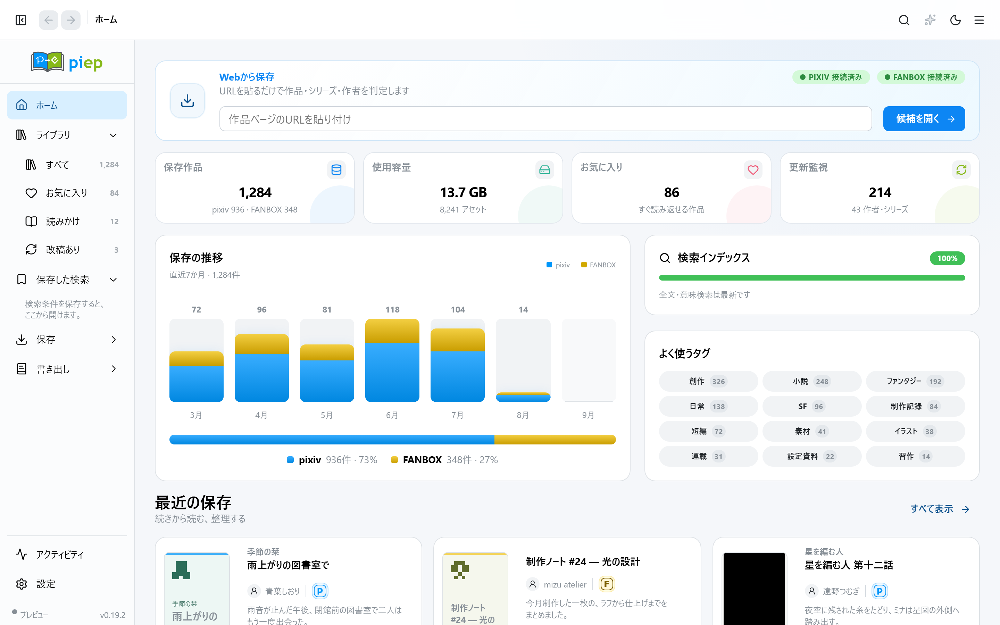

## ライブラリ
<!--screen:library-->

作品・作者・シリーズ・コレクションの四つの見方を切り替えられます。「すべて」
「お気に入り」「読みかけ」「更新監視」の棚、絞り込み、並べ替え、保存した検索、
ギャラリー／リスト表示、複数選択の一括操作。

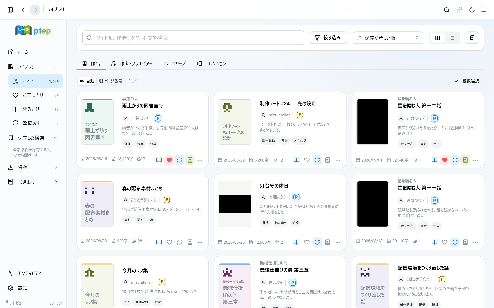

ダークテーマでも同じ形で出ます。

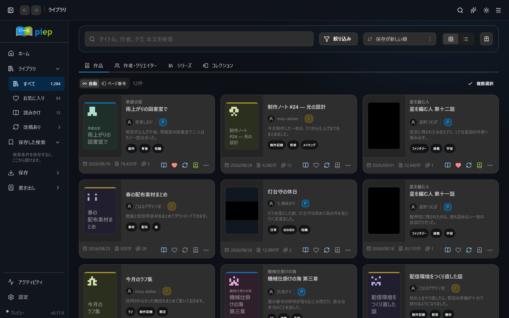

## 作者とクリエイター
<!--screen:library-people-->

保存した作品を、書いた人ごとにまとめて見る棚です。新作の監視もここから設定します。

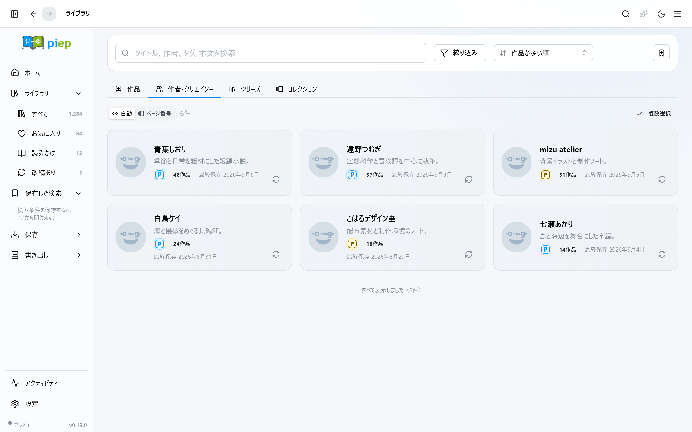

## 作品ページ
<!--screen:work-->

概要・本文・アセット・履歴・JSON を確認できます。そのまま読む、編集する、EPUB
キューに入れる、アーカイブとして書き出す、のいずれにも進めます。

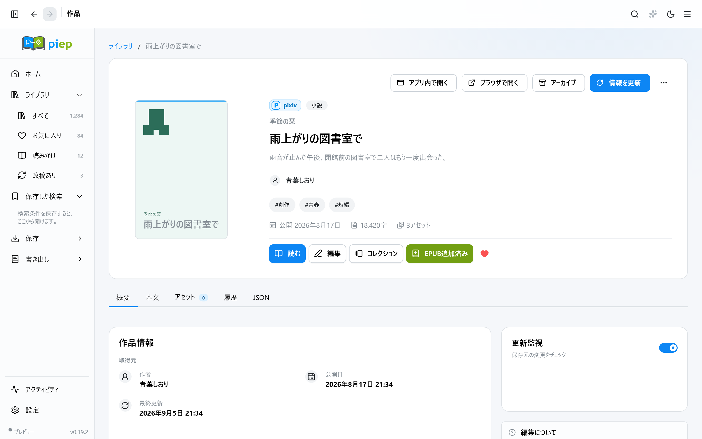

## リーダー
<!--screen:reader-->

縦書き／横書き、明朝／ゴシック、文字サイズ、行間、背景色を選べます。目次、しおり、
本文内検索（かな・カナ・全角半角の違いを吸収し、見つけた箇所に印を付けて移動）、
キーボードでのページ送り。

読みかけの位置は行単位で覚えるので、文字の大きさを変えてもずれません。

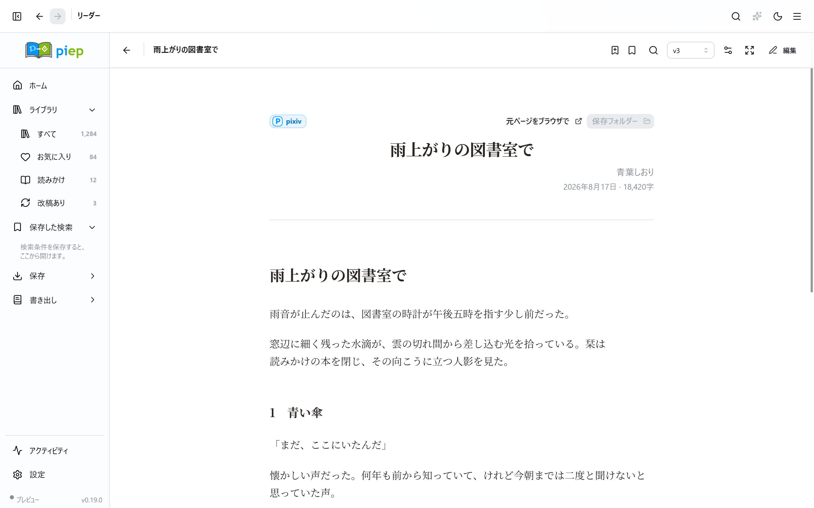

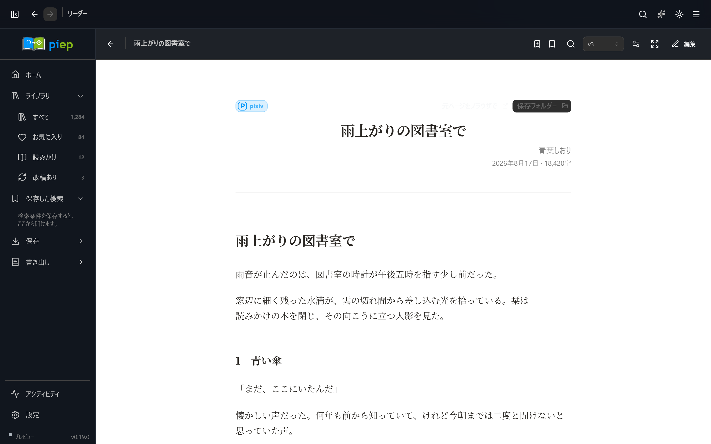

## エディタ
<!--screen:editor-->

見出しや段落をブロックとして掴んで並べ替え・書き換えでき、右側で仕上がりを確認
しながら下書きを保存できます。取り消しとやり直し、全文の置換、自動保存。

編集した本文は、挿絵も改ページも章も保ったまま EPUB へ書き出せます。元データは
そのまま残ります。

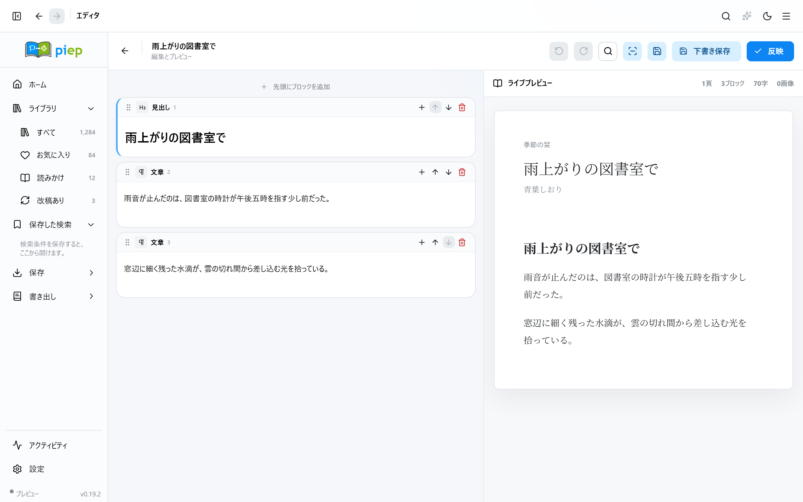

## 更新センター
<!--screen:updates-->

「確認のみ」と「自動保存」を選び、同時実行数を決めて実行します。進行中のジョブは
一時停止・再開・中止でき、失敗した分だけを後から再試行できます。

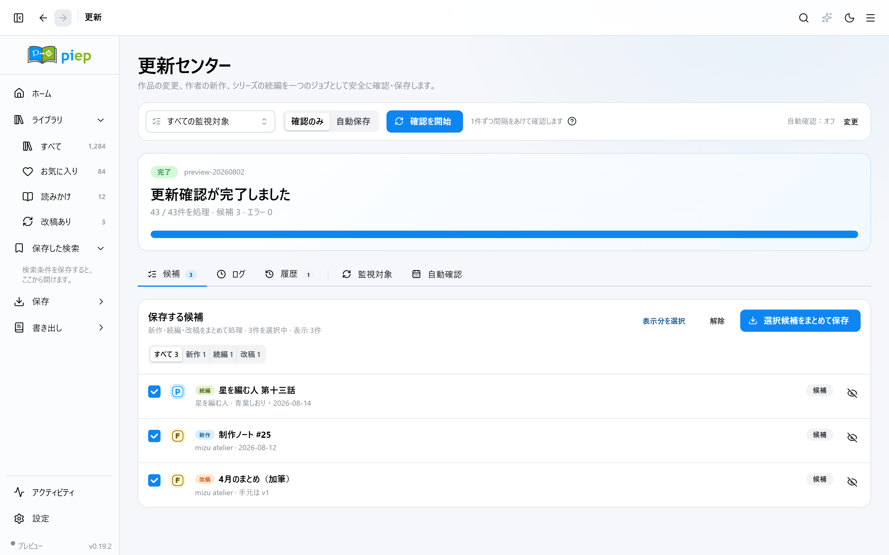

## EPUB Studio
<!--screen:epub-->

キューに入れた作品を、テンプレートと画像最適化の設定でまとめて書き出します。

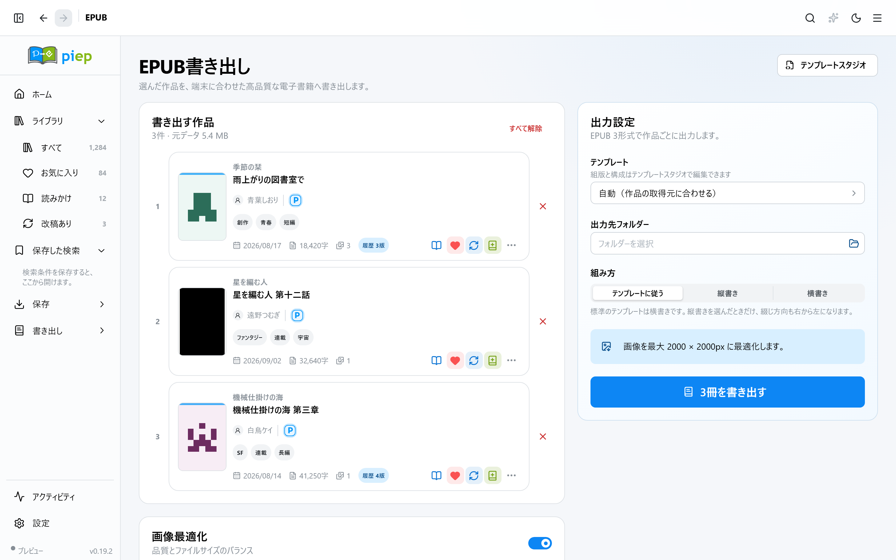

## ライブラリ診断
<!--screen:diagnostics-->

容量、索引の完成度、実データでの検索速度、孤立したアセットを測ります。SQLite の
最適化と検索索引の最適化もここから実行できます。

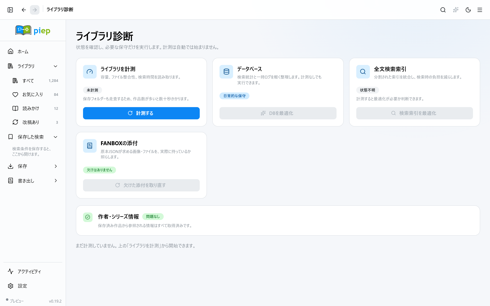

---

この頁の画面と、実際に撮っている画面が食い違うと CI が落ちます。突き合わせて
いるのは `e2e/readme-shots.spec.ts` の `shots` 表です。
