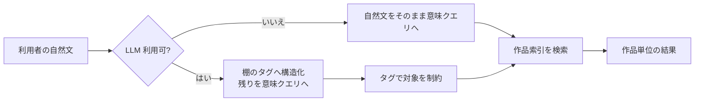

# piep の LLM・意味機能 再構成レポート

作成日: 2026-08-30（UI配置更新: 2026-08-31）  
対象: `src/`、`src-tauri/`、現行 UI の添付スクリーンショット  
位置づけ: 調査・設計と、その設計に基づく実装結果。利用者がまだいないため旧LLM設定・旧意味索引との互換層は作らず、直接置き換えた。

## 0. 実装結果（2026-08-30）

本レポートの推奨案Bを実装した。採った製品判断は次のとおり。

- 通常検索は `tantivy-lexical` のまま維持し、利用者に検索エンジンのモード選択を求めない。
- 「言葉で探す」だけを、LLMによる意図整理の後に `semantic-work-local` へ渡す。既存の絞り込みタグは消さずに統合する。
- 意味索引は `semantic-v2/semantic_works` の一作品一行へ置換した。metadata vector と本文断片の正規化重心だけを保存し、検索結果も必ず一作品一候補とする。
- 本文断片DB、ANNシャード、HNSW、RRFの死んだhybrid処理は削除した。一節検索は今回の製品機能にしないため、そのためだけの索引も作らない。
- コレクション候補・棚全体のテーマ走査も同じ作品ベクトルへ移した。
- 意味機能の有効/無効はDBに永続化し、手動再構築、自動保守、新規保存、編集・タグ変更の個別再索引が同じ値を参照する。無効化すると作品ベクトルとcoverage状態を削除する。
- すべての画面で共通の手伝いアイコンを使う。未設定時も灰色で残し、メニュー内に不足条件と設定導線を表示する。作品画面では「あらすじ」「タグ補完」を一個のランチャーへ統合した。
- LLMは7機能のfeature profileへ分離した。機能ごとの有効化、モデル、追加指示、送信項目、件数上限を設定できる。追加指示は固定JSON契約・安全規則の後ろに隔離し、それらを上書きできない。
- 共通モデルと異なる機能別モデルは、その接続先とモデルで試験済みになるまで実行しない。
- 生成物には `featureId / promptVersion / modelId / inputFingerprint / configFingerprint / createdAt` を付ける。保存メモは現在の入力を再計算し、題名・タグ・本文などが変われば古いことを表示する。候補コレクションのモデル名案は再生成可能で、モデル・日付も保持する。
- 明示的な意味検索の実行失敗は空の成功結果へ変換せず、UIへエラーとして返す。埋め込みモデルの初期化失敗もprocess-globalに固定せず、次回操作で再試行できる。

外部APIキーは設定JSONにもリクエスト型にも追加していない。現時点の対応先は、認証不要のローカルOpenAI互換サーバー、または認証不要かつ利用者が明示許可したHTTPS先に限定する。平文キーを足すより、OS資格情報ストアを導入する別変更として扱う。

### 0.1 AI入口と絞り込み表示の配置更新（2026-08-31）

AIランチャーは、単に本文内から上へ移動するのではなく、作用範囲で配置を分けた。

- ライブラリの「言葉で探す」、作品のあらすじ・タグ補完、作者の作風メモ、コレクションの命名・分割は、対象が画面全体で一意なのでアプリヘッダー右側へ集約した。ヘッダー右側は索引進捗、検索、AI、外観、アプリメニューの順とし、検索とAIを隣接させつつ、日常的な検索を先に置く。
- ヘッダーには常に一つの星アイコンを残す。実行可能な通常時は黒い輪郭だけとし、カーソルを合わせたとき、キーボードフォーカス時、メニューを開いている間だけ紫の輪郭にする。すべて未設定または対象外なら、星の面を薄い灰色、輪郭を一段濃い灰色にして区別する。利用不可でも押せて、使えない理由と設定への導線を確認できる。
- タブで作用対象が変わる場合は、現在のタブにだけ該当機能を登録する。別タブで誤って実行される機能をヘッダーへ残さない。
- 候補コレクション各カードの命名、リーダーの「前の作品」要約など、同じ画面に対象が複数存在し得る操作は対象のそばに残す。これを一つのヘッダーへ束ねると、実行先が分からなくなるためである。
- 保存済みの生成結果は元の本文位置に残す。入口だけをヘッダーへ移し、結果と採用・破棄操作まで画面から切り離さない。

タグ絞り込みは、フィルタードロワー内の選択値とツールバーの「適用中」を共通の `FilterToken` に置き換えた。含める条件は同じ水色、除外条件は同じ構造の赤色とし、境界線、文字ウェイト、削除ボタン、アクセシブル名も一箇所で管理する。入力中だけ灰色、適用後だけ水色という、同じ状態を別物に見せる差をなくした。

### 0.2 候補の量と確からしさ、コレクションの二つのオーバーレイ（2026-09-02）

走査が実際に使われて出てきた三つの不満に答えた。「一度に大量に出すぎる」「探した結果が棚の上に居座る」「作ったあとの束に、あとから届いた作品を入れる手立てがない」。

#### 出す量ではなく、出す基準を変えた

走査は系統ごとに200件まで作り、**大きい束から順に**採っていた。この二つは両方とも間違っていた。

大きさは確からしさではない。共有タグで24作が集まったゆるい束より、本文リンクでつながった3作のほうがずっと確かである。大きい順に採る規則は、いちばん確かなものから順に切り捨てる規則でもあった。しかも見つけ方ごとの確からしさは、計算されたそばから捨てられていた — 本文リンクの `confidence` は `let (from, to, _confidence)` で読み飛ばされ、テーマ束の z 値は `tighten_to_baseline` が `Some(kept)` を返した瞬間に消えていた。保存先の `collection_suggestions.score` 列は、走査のすべての行に定数 `1.0` が入っていた。

そこで見つけ方ごとに違う意味を持つ数を、一本の尺度（`SweepBundle.strength`、0.0〜1.0）へそろえた。

| 見つけ方 | 確からしさの出どころ |
|---|---|
| 本文リンク | 塊の中にある辺の確信度の平均 |
| 公式シリーズの連番 | 0.95（取得元が「同じシリーズの何話目か」を言っており、話数も途切れていない） |
| 題名族 | 話数の語が付いている割合と、共通語幹の長さ |
| テーマ | 締め終えた顔ぶれで測った、棚の水準からの隔たり（z）を 0.55〜1.0 へ写したもの |

そのうえで上限を系統あたり200件から8件へ落とし、下限（0.55）を切り、残ったものから**重みつきの籤**で引く（Efraimidis–Spirakis、重みは確からしさの8乗）。毎回まったく同じ8件だと9番目以降は永久に日の目を見ないが、一様な籤では確からしさを測った意味が無くなる。強い束はほぼ必ず入り、下位にも席が回るので、「もう一度探す」に意味が生まれる。

`collection_suggestions.score` には実際の確からしさが入るようになり、受信箱の並びも `score DESC` を先頭にした。これまでは走査の行がすべて同じ時刻に入るので、`updated_at DESC, id DESC` は実質 id 順、つまり無作為だった。

#### まとまりを探すは、名前を付け直すと同じくオーバーレイにする

結果を棚の一覧の途中に差し込んでいた。候補が出ているあいだ、コレクションそのものが下へ押し出される。候補は**片付けるもの**で、棚の上に居座る種類の情報ではない。始めて、見て、採るか閉じるかして、終わる。その一続きが一枚で完結するなら、それはオーバーレイである。

棚の見出しに残るのは入口の一本だけで、まだ片付けていない候補の数をボタンに添える。

#### すでにある束へ、あとから合う作品を探す

コレクションは作った時点で閉じない。新作は毎日届くし、旧作をあとから保存することもある。作ったときの顔ぶれに縛られる理由が無いのは、名前と同じである。これまでは「作品を追加」から棚を自分でたどるしかなかったが、3,900作の棚で「この束に足りないのはどれか」を人が思い出すのは、できない相談だった。

`db_suggest_collection_additions` は束のメンバーを起点に、規則（本文リンク、公式シリーズ、作者＋題名族、作者＋共有タグ、共有タグ）と意味（束の作品への平均余弦の z）を別々に測り、**強いほうを採る**。両方が同じ作品を指しているときだけ少し足す。掛け合わせにしないのは、片方しか無い作品 — 意味索引の無い棚、タグの付いていない新作 — を 0 にしないためである。

意味の側は**平均**を採る。`similar_works` は種ごとの最大を採るが、それは「1作にだけ似ていればよい」という規則である。束へ足すなら束全体に馴染むかを見たいので、最大では緩すぎる。

出す件数は6件、下限は 0.62（走査の 0.55 より厳しい — すでにある束を汚すほうが、見つけ損なうより高くつく）。ここにも同じ籤を使うので、もう一度押せば別の顔が出てくる。

#### 実データに当てて分かったこと

`cargo run --release --example collection_sweep_probe` と、新しく足した `collection_additions_probe` を 3,938作の棚に当てた。

走査は **332束 / 1,381作 / 17秒** から **16束（続き物8・テーマ8）/ 91作 / 1.0秒**になった。速くなったのは束が減ったからだけではなく、「二度と出さない」の照会をまとめたためである。三度続けて走らせると毎回ちがう16件が出て、どの回も中身は読める束だった。

追加候補のほうは、走らせて初めて見えた壊れ方がある。

**取得元の「シリーズ」は、連載とはかぎらない。** ある4作の束のメンバーが属していた pixiv シリーズ 8434120 は**151作**あり、中身は対魔忍もアイマスも混ざった「依頼もの置き場」だった。「同じ公式シリーズ」を 0.95 の根拠にしていたので、無関係な151作がその顔をして並んだ。読む単位として持てる大きさ（40作、`MAX_BUNDLE` と同じ理由）を超えるシリーズと、呼び名が事務的なシリーズは、0.60 へ落とす。0 にはしない — 同じ置き場に入れている以上は近いが、**それだけでは束に入れない**（下限 0.62 を割る）。

直した後、2作の束「Dクラスのモブな弱者男子生徒に催眠アプリを使われた結果」に出るのは第4話・第6話・第19話・第33話・第35話になった。直す前は無関係な Fate と SAO の作品が 0.95 で並んでいた。

**ついでに分かった、まだ直していないこと。** `download_series.content_order` はこの棚の3,802行**すべてが NULL** である。`sweep_series_runs` は `content_order IS NOT NULL` を要求するので、走査の「公式シリーズの連番」系統は実データ上ひとつも束を作っていない。走査の出力にも `series_run` の根拠は一度も現れない。取得側で話数を拾えていないのか、保存していないのかは別に調べる必要がある。

#### 同時に直した壊れ方

- **まとめた束の大きさと根拠が食い違っていた。** `merge_overlapping` の上限は `MAX_BUNDLE`(40) で、テーマの上限 `THEME_MAX_MEMBERS`(24) ではない。重なりの大きい二つのテーマ束をまとめると24作までと決めたはずの束が40作になり、しかも近さを測り直さないので根拠の一行は「本文も近い40作です」と言った — その40作でそれを確かめたことは一度も無いのに。まとめたあとに締め直すようにした。
- **棚の水準を測る対が、名前ほど多くなかった。** `(step * stride + 1) % count` は `step` が `count` 増えても同じ値へ戻る。4周まわしても拾えていた対は `count` 種類しか無く、3,938作の棚で「20,000対」と称して実際に見ていたのは3,938対だった。周回ごとに相手をずらすようにした。
- **意味索引が読めないことを、題材の束が無いことと同じ顔で出していた。** 走査は `log::warn!` を残して空を返していた。`CollectionSweepResult` に `semanticUsed` と `note` を足し、画面へ「一部しか探せていません」と出す。
- **別版の畳み込みが、一人のために全員ぶん消えていた。** `load_member_editions` は走査上限に触れると空の `HashMap` を返していたが、SQL は束に居るすべての作者をまとめて引いている。中くらいの作者が数人そろっただけで、全員ぶんの畳み込みが消えた。途中まででも畳めた組は正しいので、集めたぶんを返すようにした。
- **「二度と出さない」の照会が、組ごとに1往復していた。** 40作の束で780回、走査ぜんぶで数十万回。表は利用者が押した回数ぶんしか行が無いので、一度に読むようにした。
- **メタデータの向きだけ、長さをそろえていなかった。** 本文の重心は `mean_normalized_vector` がそろえるが、メタデータの向きは埋め込みが返したものをそのまま保存していた。`cosine_similarity` は内積をそのまま余弦として使うので、これは「fastembed は正規化して返す」という、どこにも書いていない前提の上に乗っていた。しかも `.clamp(0.0, 1.0)` が1を超えた内積を隠すので、破れても見えない。保存する時点でそろえるようにした。
- **保存した検索が、意味検索であることを忘れていた。** 「言葉で探す」で作った検索を保存して開き直すと、字面検索に落ちていた。しかも検索欄に残っているのは利用者が打った言葉ではなくモデルの言い換えなので、開き直した結果は元の検索とも素直な字面検索とも違うものになった。`paramsJson` に `searchMode` を持たせた。
- **分割案が、作成に失敗すると案ごと消えていた。** `onSplit` を呼んで無条件に窓を閉じ、閉じると案を捨てていた。作れたかどうかを返してもらい、作れたときだけ閉じる。
- **設定を保存するたびに索引の作り直しが走っていた。** 追加指示の一文を直して保存しただけで再構築が始まり、棚の書き込み権を取っていた。意味検索の入り切りが変わったときだけ触る。
- **「索引を作成中」が、作っていない場合にも出ていた。** 待てば終わるのか、自分で始めないと何も起きないのかは、利用者が次に取る行動を変える。分けて出し、進み具合の数も添えた。

## 1. 結論

再構成の軸は「AI を一つの機能として置く」ことではなく、次の三層を分けることです。

1. **通常機能** — 字面検索、手入力、ルールによるコレクション候補。追加モデルなしで必ず使える。
2. **意味機能** — 埋め込みモデルによる作品単位の類似・自然文検索。LLM 接続とは独立したローカル能力。
3. **LLM の手伝い** — タグ抽出、要約、命名など、構造化された案を作る任意機能。

推奨案は次のとおりです。

- 画面ごとの大きな紫色パネルをやめ、各画面の主操作付近に共通の **手伝いアイコン**を一つ置く。
- アイコンは常に同じ場所に置く。使えない場合も消さずに灰色で出し、押すと「この画面で使える機能」と不足条件を表示する。
- 言葉で探す、作品の類似、コレクションのテーマ判定は、**作品一つにつき一つのベクトル**を持つ新しい作品索引へ移す。
- 本文断片の索引は通常検索から切り離す。「作品内・全棚から一節を探す」を本当に作る場合だけ、別機能として残す。
- LLM 設定は接続先だけでなく、機能別の有効化、使用モデル、入力項目、追加指示、出力条件、本文送信許可を持たせる。ただし出力 JSON 契約や安全規則はアプリ側に固定し、利用者が壊せないようにする。
- 既存の `smart / exact / semantic` という利用者向けモード切替は作らない。内部の検索計画として型を分ける。

最初に着手すべきなのは、意味検索の配線を足すことではありません。**能力レジストリと作品単位索引の境界を先に作ること**です。今の断片検索へ入口だけ足すと、長い作品ほど有利なランキングと、断片数を分母にしたページングを製品化してしまいます。

## 2. 調査で確認できた現状

### 2.1 LLM 機能の棚卸し

| 機能 | 現在の入口 | モデルへ渡す主な情報 | 結果 | 現状の問題 |
|---|---|---|---|---|
| 言葉で探す | ライブラリ検索欄横の星アイコン | 利用者の自由文、棚の上位タグ語彙 | タグ条件と検索語 | 意味検索用の語が通常の字面検索へ流れる。LLM 未設定では入口ごと消える |
| 作品のあらすじ | 作品概要タブ先頭の常設カード | 題名、タグ、概要、本文全体 | 永続メモ | 大きなカードが通常情報を押し下げる。本文許可は全機能共通の一個のスイッチ |
| タグの補完 | 作品概要タブ先頭の常設カード | 題名、概要、既存タグ、棚のタグ語彙 | 選択したタグを `llm` 出所で保存 | 入口の面積が大きい。削除失敗など一部エラーが見えない |
| 作者の作風メモ | 作者ページの作品タブ先頭 | 最大30作の題名・タグ等 | 永続メモ | 未設定時は機能の存在ごと消える |
| 前回のあらすじ | 読む順のあるリーダー文脈内 | 前作本文、現在作の識別 | 永続メモ | 読み進める主導線を押し下げる。長時間処理の中止・進捗がない |
| コレクション命名 | 名前変更モーダル | メンバーの題名、作者、タグ、シリーズ | 名前と説明の案 | 通常の名前変更に AI 設定広告が混ざる。試し書きもこの一種類だけ |
| 候補コレクション命名 | 候補カード内 | 候補メンバーの題名等 | 名前候補として保存 | 一度生成すると再生成できず、モデル・日付が表示されない |
| コレクション分割 | コレクションのその他メニュー | メンバーの題名・タグ | 分割案。採用時に新しい束を作る | 他画面と違い、未設定でも入口を見せる。作成失敗時に案を失う |

LLM 呼び出しは [`assistApi.ts`](../src/services/assistApi.ts#L173-L294) にまとまっています。現在の設定が持つのは `baseUrl`、`model`、外部送信同意、本文許可、全体の有効/無効、試し書き済みの対象だけです（[`assistApi.ts`](../src/services/assistApi.ts#L11-L39)）。機能別プロンプト、機能別モデル、入力項目、出力長、言語、生成パラメータは設定できません。

一方、安全面の土台は残す価値があります。

- 既定 OFF で、モデルを同梱しない（[`assistApi.ts`](../src/services/assistApi.ts#L30-L39)）。
- 外部 URL は HTTPS、宛先ごとの同意、現在の URL とモデルでの試し書きを要求する（[`assistApi.ts`](../src/services/assistApi.ts#L102-L120)）。
- 本文を使う関数を `work_facts_with_body` として分離し、本文許可を二重確認する（[`assist_inputs.rs`](../src-tauri/src/database/queries/assist_inputs.rs#L1-L5)、[`assist_inputs.rs`](../src-tauri/src/database/queries/assist_inputs.rs#L192-L203)）。
- タグは棚の語彙へ閉じ、根拠文字列も検証してから候補に残す（[`assist.rs`](../src-tauri/src/assist.rs#L1093-L1194)）。
- 返答へ JSON schema を要求し、案の採用を別操作にしている（[`assist.rs`](../src-tauri/src/assist.rs#L644-L704)、[`AssistPanel.tsx`](../src/features/assist/AssistPanel.tsx#L5-L16)）。

### 2.2 意味機能の棚卸し

意味機能は一つではありません。現在も用途の異なる三経路があります。

| 経路 | 単位 | 到達性 | 実際の使われ方 |
|---|---|---|---|
| ライブラリ `searchMode: semantic` | 本文・メタデータ断片 | バックエンドとテストはあるが UI から到達不能 | 断片ヒットを作品へ集約して作品一覧を返す |
| 1作品からコレクション候補を広げる | 本文・メタデータ断片 | UI から到達可能 | `semantic_index::search` の上位断片を候補集合へ足し、閾値以上なら控えめに加点 |
| 棚全体からテーマ束を探す | 作品本文の重心 | UI から到達可能 | 共有タグで候補を作り、作品重心の近さでテーマ束を絞る |

重要な訂正があります。意味検索が production で使われるのは一箇所だけではありません。ライブラリのコレクションタブにある「まとまりを探す」から、[`collection_sweep.rs`](../src-tauri/src/database/queries/collection_sweep.rs#L361-L426) の作品重心を使うテーマ走査へ到達できます。さらに、1作品起点の候補生成は [`collections.rs`](../src-tauri/src/database/queries/collections.rs#L1451-L1473) で断片検索を使っています。ただし後者は作品重心ではなく、断片ヒットの作品ごとの最大値です。

### 2.3 独立に確認できた重大な不整合

#### A. `smart` は実際には字面検索だけなのに、結果メタデータは `hybrid-local`

`semantic` 以外は [`mod.rs`](../src-tauri/src/database/queries/mod.rs#L3474-L3496) で字面検索へ早期 return します。そのため、その下の字面検索枝と RRF の字面側は通常到達しません。それでも後段は `smart` を `hybrid-local` と命名します（[`mod.rs`](../src-tauri/src/database/queries/mod.rs#L3627-L3646)）。テストも「smart に semantic 理由が無い」ことと `hybrid-local` という名前を同時に固定しています（[`search_integration_tests.rs`](../src-tauri/src/database/queries/search_integration_tests.rs#L4128-L4152)）。

これは死んだコードだけの問題ではなく、診断・将来の保守・利用者説明の三つを誤らせます。

#### B. 「言葉で探す」の検索語が、型契約に反して字面検索へ入る

`SearchIntent.query` は「意味検索へ渡す言い換え」と定義されています（[`assistApi.ts`](../src/services/assistApi.ts#L207-L220)）。しかし適用時には検索欄へ入れるだけです（[`LibraryPage.tsx`](../src/features/library/LibraryPage.tsx#L1418-L1433)）。検索リクエストは `text` とタグを渡し、`searchMode` を渡しません（[`LibraryPage.tsx`](../src/features/library/LibraryPage.tsx#L737-L760)）。

さらに LLM が返した include/exclude タグは既存の条件へ追加せず、置き換えます。これは意味配線とは別の UX 破壊です。

#### C. 断片ヒットのスコアを作品ごとに加算しており、長編が有利

意味ヒットは断片単位です。作品へまとめる際、同じ作品の断片が現れるたびにスコアを加算します（[`mod.rs`](../src-tauri/src/database/queries/mod.rs#L10257-L10276)）。1作品あたりの断片数を正規化していないため、長い作品は上位候補へ複数断片を送り込みやすく、作品ランキングで構造的に有利です。

候補拡張の上限も作品数ではなく索引済み断片数です（[`mod.rs`](../src-tauri/src/database/queries/mod.rs#L3501-L3504)）。そのため「全作品を見終えたか」と「断片を何件取ったか」が一致しません。

#### D. 意味索引の opt-in が、再構築と個別更新で食い違う

手動・自動の一括再構築は `include_semantic = false` が既定です（[`mod.rs`](../src-tauri/src/database/queries/mod.rs#L105-L121)、[`database.rs`](../src-tauri/src/commands/database.rs#L123-L179)）。しかし作品の個別再索引は `include_semantic = true` を固定で渡します（[`mod.rs`](../src-tauri/src/database/queries/mod.rs#L12441-L12451)）。新規保存、タグ変更、編集確定などからこの経路へ到達します。

つまり現在のチェックボックスは「意味機能を使う設定」ではなく、**その一回の一括再構築に意味ベクトルを含めるか**です。設定を外していても個別更新は埋め込みモデルの初期化を試み、モデル実装はキャッシュが無ければダウンロード進捗を有効にして初期化します（[`semantic_index.rs`](../src-tauri/src/database/semantic_index.rs#L923-L979)）。UI の説明と実行方針が一致していません。

#### E. 「索引が未完成」が利用地点へ届かない

設定・ホーム・診断には意味索引の件数があります。しかし「言葉で探す」やコレクション候補の画面は、意味索引が一部しかない場合も、その事実を結果の近くに出しません。`SearchV2Result.searchMeta` は完成度を持つのに（[`library.ts`](../src/types/library.ts#L493-L512)）、ライブラリは説明文しか表示していません（[`LibraryPage.tsx`](../src/features/library/LibraryPage.tsx#L1324-L1333)）。

#### F. README が現状より強い主張をしている

README は「意味の近さでも探せます」と説明しています（[`README.md`](../README.md#L19-L30)）。現行 UI からライブラリの意味検索へ到達できず、`smart` も semantic を混ぜていないため、少なくとも通常検索については現在の製品挙動を表していません。

#### G. semantic の失敗を「一致なし」に変換している

semantic 検索のエラーは warning を残すだけで空配列へ変換されます（[`mod.rs`](../src-tauri/src/database/queries/mod.rs#L3513-L3519)）。レスポンス自体は `semantic-local` の成功として返るため、モデル初期化失敗、ANN 読込失敗、本当に0件、を UI から区別できません。

#### H. 一部の既知問題はすでに修正済み

添付された分析にある「シャード作り直しと読込が競合し、ときどき空になる」問題は、現在のコードでは同じロックを読了まで保持する形に修正されています（[`semantic_index.rs`](../src-tauri/src/database/semantic_index.rs#L316-L325)）。今回の再構成理由へは数えず、回帰テストとして残すべき事項です。

ただし別の状態問題があります。埋め込み runtime の初期化結果は process-global に固定され、初回失敗後は同じプロセス内で再試行できません（[`semantic_index.rs`](../src-tauri/src/database/semantic_index.rs#L923-L936)）。また `model_ready` は未初期化と失敗を区別せず、再起動直後はモデルファイルと索引があっても false です（[`semantic_index.rs`](../src-tauri/src/database/semantic_index.rs#L991-L1012)）。この値を事前条件にするコレクション候補は、その回に semantic を黙ってスキップします。

#### I. 生成と保存の契約も揃っていない

共通説明は「返答は案で、採る操作は別」としていますが、作者メモ、作品あらすじ、前回のあらすじは生成 command の中で即 `ai_notes` へ保存します（[`assist.rs`](../src-tauri/src/assist.rs#L1052-L1060)、[`commands/assist.rs`](../src-tauri/src/commands/assist.rs#L149-L173)、[`commands/assist.rs`](../src-tauri/src/commands/assist.rs#L189-L240)）。自動保存する生成物と preview→accept する案を feature descriptor で明示的に分ける必要があります。

## 3. UI/UX の推奨設計

### 3.1 共通部品: `ContextAssistButton`

各画面に一つだけ、星形のアイコンボタンを置きます。押すと小さなメニューまたは右ドロワーが開き、その画面で使える機能を列挙します。

ボタンを隠さない理由は、現在の「設定済みなら出す」設計では機能を発見できず、画面ごとに隠す・警告を出す・保存結果だけ出す、の三方式が混在しているためです。

#### ボタンの状態

| 状態 | 見た目 | 押したとき |
|---|---|---|
| LLM も意味機能も未設定 | 灰色、通常の枠線 | 利用可能な機能一覧を表示。各項目に「言語モデルが必要」「意味索引が必要」と設定リンク |
| 一部だけ利用可能 | 灰色のまま、小さな状態点 | 使える項目は通常表示、使えない項目は disabled＋理由 |
| 利用可能 | 通常の前景色 | 機能一覧を表示。色で「AI の種類」を表さない |
| 実行中 | アイコン内スピナー | 実行中の機能、進捗、中止を表示 |
| 結果あり | 控えめな点 | 保存済み結果を開く。画面本文へ巨大な常設カードは出さない |
| エラー | 小さな警告点 | メニュー内に失敗理由と再試行。トーストだけで終わらせない |

「未設定なら静か」という既存方針は、**消す**のではなく灰色で一個だけ置くことで守れます。機能ごとの紫カードを何枚も置かず、色も要素の種類ではなく状態にだけ使います。

### 3.2 画面ごとの配置

| 画面 | アイコン位置 | メニュー項目 | 結果の置き場所 |
|---|---|---|---|
| ライブラリ | 検索欄の直後。添付画像2の形 | 言葉で探す、意味索引の状態 | 自然文入力はモーダル。適用したタグと検索意図は検索条件行へ表示 |
| 作品 | ヘッダーの「読む・編集・書き出す」群の末尾 | あらすじ、タグ候補、似た作品 | あらすじは概要内の折り畳みメモ。タグ案はドロワー内で採用 |
| 作者 | 作者ヘッダーの操作群の末尾 | 作風メモ、よく使うタグの確認 | 生成済みメモだけ、作品一覧の上に一行要約＋展開 |
| リーダー | 読書ツールバー | 前回のあらすじ | 読書を始める前の折り畳み。次/前ナビを押し下げない |
| コレクション | ヘッダーのその他操作の手前 | 名前案、分割案、似たまとまりを探す | すべてドロワー内でプレビューし、採用後だけ通常 UI に反映 |
| 候補コレクション | 候補カードの補助操作 | 名前案を追加 | 候補の選択肢として表示。モデル・日付・再生成を揃える |

コレクションの「名前を付け直す」は通常機能です。そこへ AI を混ぜず、手入力・ルール案は通常モーダル、LLM 案は手伝いメニューから同じ編集状態へ追加する形が自然です。

### 3.3 機能の availability は一個の boolean にしない

現在の `useAssist()` は `engine` があるかどうかへ集約しすぎています。次の能力を別々に返す `useCapabilities(context)` が必要です。

```ts
type CapabilityState =
  | { state: "ready" }
  | { state: "unavailable"; reason: string; settingsHref?: string }
  | { state: "partial"; coverage: number; reason: string }
  | { state: "busy"; jobId: string; progress?: number }
  | { state: "error"; message: string; retryable: boolean };

interface AssistCapabilities {
  llmMetadata: CapabilityState;
  llmBody: CapabilityState;
  semanticWorks: CapabilityState;
  semanticPassages: CapabilityState;
}
```

この分離により、「LLM は無いが意味検索は使える」「LLM は使えるが本文は送れない」「作品索引は100%だが一節索引は作っていない」を正確に表せます。

## 4. 設定画面の再設計

設定ナビは「AI・意味機能」へまとめても、内部では能力を混ぜません。

### 4.1 概要

最初に四つだけ出します。

- 言語モデル: 未設定 / ローカル / 外部、選択中のモデル
- 作品の意味索引: 無効 / 構築中 / 5,410作品中5,410作品
- 一節索引: 無効 / 構築中 / 対象作品数・断片数
- 本文の外部送信: 禁止 / 機能別に許可

ここでのスイッチは永続的な方針です。現在の「次の再構築だけに含める」一時チェックとは分けます。

### 4.2 言語モデル接続

現行の「探す → 試す → 使う」は維持し、接続をプロフィール化します。

```text
接続プロフィール
  id / name / base_url / model / auth_ref
  local_or_remote / verified_at / capabilities
  context_length / structured_output / max_parallel
```

追加すべきもの:

- 複数プロフィールと機能別モデル選択
- API key を安全な資格情報ストアへ保存し、設定 JSON へ平文保存しない仕組み
- 機能別の試験。命名だけの試し書き成功を、長文要約やタグ JSON の readiness に流用しない
- 送信予定データのプレビュー
- 「言葉で探す」で利用者が入力した自由文も外部へ送ることの明記

### 4.3 機能別設定

各機能は同じ編集形式を使います。

| 設定 | 例 | 方針 |
|---|---|---|
| 有効/無効 | この機能をメニューに出す | 機能ごとに持つ |
| 使用モデル | `qwen...` | 接続プロフィールから選ぶ |
| 入力項目 | 題名、タグ、概要、本文 | 必須項目は外せない。各項目に送信先と件数を表示 |
| 追加指示 | 「結末を含めない」 | アプリ固定の system 契約の後ろへ安全に追加 |
| 出力条件 | 3文、最大300字 | 型付きの設定にする |
| 生成の強さ | 厳密 / 標準 / 発想寄り | temperature の生値は詳細設定へ隠す |
| 保存 | 自動保存 / 採用時保存 | 機能ごとに明示 |

#### プロンプトを丸ごと自由編集にしない

プロンプトは三層に分けます。

1. **契約プロンプト** — JSON schema、語彙制約、本文中の命令を命令として扱わない規則。アプリが所有し編集不可。
2. **機能テンプレート** — 何を抽出するか。詳細設定で表示し、既定へ戻せる。
3. **利用者の追加指示** — 文体、長さ、避けたい内容など。通常設定で編集可。

完全な raw override は開発者向けに限定し、出力 schema の検証は外せないようにします。自由編集で安全規則や parser 契約まで消せる設計は避けるべきです。

### 4.4 生成物の provenance と鮮度

現在の `ai_notes` は本文、モデル ID、作成日時だけです（[`schema.rs`](../src-tauri/src/database/schema.rs#L226-L240)）。次を追加します。

```text
feature_id
engine_profile_id
model_id
prompt_version
user_instruction_hash
input_fingerprint
input_summary_json
created_at
status: current | stale | failed
```

本文、題名、タグ、メンバー構成が変わったら `input_fingerprint` を比較し、「古いメモ」と表示できます。作り直し前に旧版を残すかは機能ごとに決めます。

## 5. 意味検索の再設計

### 5.1 索引を二つの製品機能へ分ける

#### 作品索引 `semantic_works_v2`

目的:

- 「こういう話」を自然文で探す
- 似た作品を出す
- 字面候補の再ランク
- テーマコレクションを絞る

一作品につき、少なくとも次の二ベクトルを持ちます。

```text
metadata_vector = title + author + tags + series + excerpt
content_vector  = body chunk vectors の正規化平均（本文がある場合だけ）
```

最終の作品スコアは用途別に `metadata` と `content` の重みを変えます。本文がない画像作品も metadata ベクトルで検索対象に残せます。本文重心だけにすると、FANBOX の画像中心作品などが消えるためです。

数千〜数万作品なら、384次元のベクトルを順にコサイン計算しても候補生成は十分小さい可能性が高く、まず総当たりで p50/p95 を測ります。必要性が確認できるまで HNSW、シャード、マニフェストを持ち込みません。

意味モデルの切替は初版の設定へ出さないことを推奨します。現在は model ID、次元数、`semantic-v1` namespace、runtime、ANN manifest が固定です。切替可能にするには `(model_id, dimension, index_format)` ごとの名前空間、runtime の unload/retry、並行移行、取得進捗と取消が必要で、単なるモデル名欄では成立しません。

#### 一節索引 `semantic_passages_v2`

目的:

- 「あの場面・一節」を全棚から探す
- 一作品の中から意味の近い箇所を探す

返すものは作品カードではなく、引用、作品名、位置、前後文脈です。ランキング単位も断片のままで、作品一覧へ無理に潰しません。ユーザーがこの機能を明確に欲しいと判断するまでは既定 OFF、生成もしません。

### 5.2 「言葉で探す」は LLM と意味検索を独立させる

推奨フロー:



LLM は「意味検索を使うための必須条件」ではありません。LLM が無ければ自然文をそのまま埋め込み、あれば棚のタグ条件を抽出して精度と説明性を足します。

適用後は URL に、利用者の原文、採用したタグ、内部の検索 plan を復元可能な形で置きます。モデルの言い換えだけを URL の `q` に置くと、戻る操作や保存した検索で意図を失います。

### 5.3 通常検索は字面を主役にする

通常の検索欄は題名、作者、シリーズ、タグ、本文中の語を再発見するためのものです。ここへ毎回埋め込み遅延を足しません。

内部 plan は次のようにします。

```rust
enum SearchPlan {
    Lexical,
    NaturalLanguageWorkSearch,
    LexicalThenWorkRerank { top_n: usize },
    PassageSearch,
}
```

- 通常入力: `Lexical`
- 「言葉で探す」: `NaturalLanguageWorkSearch`
- 実測で効果が確認できた場合だけ: `LexicalThenWorkRerank`
- 明示的な一節検索画面: `PassageSearch`

利用者に `smart / exact / semantic` を選ばせず、入口の目的で plan を決めます。

### 5.4 長編バイアスを再発させない規則

- 作品検索の候補は一作品一行、一作品一スコア。
- 一節検索の候補は一断片一行。作品単位に加算しない。
- 断片を作品へ要約する必要がある場合は最大値、または固定個数 top-k の平均を使い、ヒット数の単純加算を禁止する。
- 総件数、カーソル、完了条件の分母を結果単位と揃える。
- 評価時に本文長と順位の相関を測り、長さだけで順位が上がらないことを gate にする。

### 5.5 索引状態は用途別に表示する

`semanticPendingDownloads` 一個では足りません。

```text
work_metadata: 5,410 / 5,410
work_content: 1,284 / 1,313 body-eligible works
passages: disabled
model: ready / downloading / error
```

検索結果では「作品索引 100%」だけを問題にし、一節機能では passage coverage を見るようにします。部分索引を使う場合は、結果上部に「全5,410作品中4,900作品を検索」と分母付きで表示します。黙って部分結果を返しません。

## 6. 三つの再構成案

### 案A: 整理優先 — 最小の修復

期間目安: 2〜3週間

内容:

- 共通の手伝いアイコンと機能メニューを導入
- 大きな AssistPanel は生成済み結果だけに縮小
- `smart` を正しく `lexical` と表示し、死んだ hybrid 枝を削除
- 到達不能なライブラリ semantic mode は UI へ繋がず、いったん非公開契約から除去
- LLM 機能別 enable と追加指示だけを設定へ追加
- 索引未完成表示を利用地点へ出す

利点: 小さく、現在の誤表示と UI 不統一を早く止められる。  
欠点: 断片索引のコストと、意味機能の用途不一致は残る。  
向く状況: まず v0.13 で信用を回復し、検索の作り直しを次版へ分けたい場合。

### 案B: 作品単位へ再構成 — 推奨

期間目安: 5〜8週間

内容:

- 案Aの全内容
- capability registry と機能別 profile
- `semantic_works_v2` を追加し、言葉で探す・コレクションテーマ・似た作品を移行
- 通常検索は lexical のまま、自然文入口だけ作品意味検索
- LLM なしでも自然文意味検索を利用可能にする
- `ai_notes` provenance と stale 判定
- 旧断片検索は移行中だけ読み取り専用で残し、製品入口から外す
- 20〜30件の曖昧記憶クエリで lexical / work semantic / rerank を比較

利点: ユーザーが求める UI、設定、意味検索の単位が一度に整う。本文のない作品も扱える。  
欠点: 索引 v2 と移行が必要。既存コレクション候補の挙動が変わるので評価が必要。  
向く状況: 今回を subsystem の再設計として扱う場合。**本レポートの推奨案。**

### 案C: 一節検索・書庫アシスタントまで作る

期間目安: 10〜16週間以上

内容:

- 案Bの全内容
- 一節索引を独立機能として再構築
- 引用と位置を返す全棚/作品内の意味検索
- 検索結果を根拠として答える書庫 Q&A
- OCR や画像埋め込みを別 epic として検討
- 長時間ジョブ、キャンセル、引用 provenance、キャッシュ、評価セットを本格整備

利点: 現在の163k断片を、初めて結果の見た目と一致する用途へ使える。  
欠点: UI、評価、ストレージ、引用の正しさまで別製品規模になる。  
向く状況: 一節検索を実際に使いたい要求が確認でき、案Bの基盤が安定した後。

案Cから始めるべきではありません。現時点では、一節検索を「将来の独立機能」として仕様だけ残し、索引生成は止める判断が合理的です。

## 7. 推奨案Bの実装計画

### Phase 0: 測定と契約の固定（3〜5日）

- 現行の production 到達経路をテストで固定
- `smart` が lexical-only であること、`searchMode` が UI から渡らないことを明文化
- 実棚から曖昧記憶クエリ20〜30件と正解作品を作る
- ソース別・本文有無別の作品数、断片数、索引容量、構築時間を記録
- 既存の LLM 各機能について、成功率・JSON validation failure・所要時間を記録

### Phase 1: UI と capability registry（1〜2週間）

- `AssistFeatureDescriptor` と `CapabilityState` を追加
- 共通 `ContextAssistButton`、メニュー、ドロワーを実装
- Library / Work / Author / Reader / Collection の入口を置換
- 未設定、本文禁止、索引部分完成、busy、error、保存結果ありの UI テスト
- 生成済み結果は消さず、現在の `ai_notes` と `llm` タグをそのまま読む

### Phase 2: 機能別設定と実行パイプライン（1〜2週間）

- 接続プロフィールと機能プロフィールを追加
- データ収集、prompt rendering、LLM 実行、schema validation、保存を共通 pipeline に分離
- 契約プロンプト＋追加指示の三層化
- 機能ごとの送信プレビューと本文許可
- 命名一種類だけでなく、短い JSON、長文要約を別々に試験
- `ai_notes` provenance と stale 表示

### Phase 3: 作品索引 v2（2〜3週間）

- `semantic_works_v2` sidecar/schema を追加
- metadata と content の作品ベクトルを生成
- 総当たり cosine の latency とメモリを測定
- モデル状態を `not_downloaded / downloading / ready / failed` に分け、失敗後の再試行を実装
- 言葉で探すを `NaturalLanguageWorkSearch` へ接続
- LLM あり/なしの両経路を実装
- コレクションのテーマ走査と1作品起点候補を作品索引へ移行
- 作品数を分母にした coverage と paging を実装

### Phase 4: 評価と旧経路の整理（1〜2週間）

- lexical / work semantic / lexical rerank を同じ問いで比較
- 長さ、ソース、本文有無ごとの偏りを検査
- 旧 `searchMode: semantic`、死んだ blend 分岐、誤った `hybrid-local` 表示を削除
- 旧 chunk ANN を使う production 呼び出しがゼロになったことを drift test で確認
- README、設定文言、診断を新しい能力名へ更新

### Phase 5: 一節検索の go / no-go（別 epic）

次の条件が揃うまで作りません。

- 利用者が「作品カードではなく引用を探したい」問いを継続的に持っている
- その問いの評価セットと正解位置が作れる
- 字面の作品内検索に対して意味一節検索が明確に勝つ
- 索引容量・時間を利用者が明示的に受け入れられる

no-go なら本文断片生成、HNSW、シャード、manifest を削除します。

## 8. 評価計画

### 8.1 検索

問いは原文の一文ではなく、利用者が思い出す言い方で作ります。

例:

- 雨の中で別れる話
- 主人公が誰かを待ち続けていたやつ
- 旅行先で知り合って少しずつ仲良くなる作品
- あの作者の、シリーズ名は忘れたけれど冬が舞台の話

比較:

1. lexical のみ
2. 作品 metadata ベクトル
3. 作品 content ベクトル
4. metadata + content
5. lexical 上位N件 + 作品ベクトル再ランク
6. LLM タグ抽出 + 作品ベクトル

指標:

- Recall@1 / @5 / @10
- MRR、nDCG@10
- p50 / p95 latency、初回モデル起動時間
- source別、本文有無別 coverage
- 本文長と順位・スコアの相関
- 0件、誤答、索引未完成時の説明率

出荷 gate の例:

- 自然文入口は lexical より Recall@10 が明確に上がる
- 本文長だけで順位が上がる相関が観測されない
- metadata-only 作品が無言で検索対象外にならない
- 部分索引は必ず分母付きで表示される
- p95 が通常の操作感を壊す場合はバックグラウンド化または入口を限定する

### 8.2 LLM 機能

機能ごとに別の fixture と gate を持ちます。

| 機能 | 主な検査 |
|---|---|
| タグ | 棚外語彙が0件、根拠文字列が実入力に存在、既存タグを重複しない |
| 検索解釈 | 否定を exclude へ入れる、既存条件を勝手に消さない、原文意図を保存 |
| あらすじ | 全本文範囲を処理、作中命令へ従わない、文字数・文数、捏造率 |
| 前回 recap | 前作だけを根拠にし、現在作のネタバレを混ぜない |
| 作者メモ | サンプル偏り、作品数の表示、評価語を避ける |
| 命名 | 語彙との接地、既存案を上書きしない、説明の出所 |
| 分割 | 全作品の重複・欠落がない、採用失敗時に案を保持 |

## 9. 移行・削除の順序

1. 既存の `assist_engine` 設定を最初の接続プロフィールへ読み替える。旧キーはしばらく読むだけにする。
2. 既存 `ai_notes` と `llm` タグは利用者の採用済みデータとして保持する。
3. `ai_notes` へ provenance を加えるとき、旧行は `prompt_version = legacy` として表示する。
4. `semantic_works_v2` を旧 `semantic-v1` と並行構築し、移行中は旧索引を消さない。
5. 言葉で探す、コレクションテーマ、1作品起点候補を v2 へ順に移す。
6. production の旧断片呼び出しが0になってから、ライブラリ semantic mode と dead hybrid を削除する。
7. 一節検索を作らない決定なら、chunk sidecar、ANN、モデル状態表示を削除し、容量を回収する。
8. README の「意味の近さでも探せます」は、v2 が UI から使え、coverage が説明できる時点で再び有効な主張にする。

## 10. 直近の判断事項

実装開始前に決める必要があるのは次の三点です。

1. **一節検索は今回の範囲外にするか。** 推奨は範囲外。旧断片索引は移行用にだけ残す。
2. **LLM 設定を複数接続プロフィールまで広げるか。** 推奨は広げる。長文と短い構造化出力で適するモデルが違うため。
3. **raw prompt 編集を一般設定へ出すか。** 推奨は出さず、追加指示と型付き出力条件を通常 UI、raw override を開発者向けにする。

この三点を上記の推奨どおりに置けば、Phase 1 から着手できます。最初の変更単位は `searchMode` の配線ではなく、`CapabilityState`、`AssistFeatureDescriptor`、`ContextAssistButton` の追加です。
