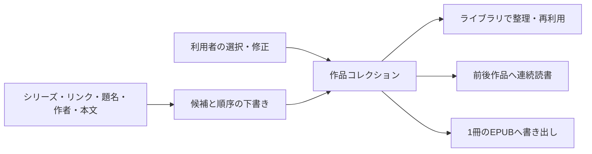

# 作品コレクションを中核にした読書・整理・EPUB統合 — 設計提案レポート

調査・提案日: 2026-08-17  
状態: **調査・設計提案のみ。コードは変更していない。**  
対象: piep のライブラリ、作品詳細、リーダー、検索索引、pixiv / FANBOX 保存データ、EPUB 書き出し  
前提資料: [複数の作品を 1 冊の EPUB にまとめる — 設計提案レポート](epub-merge-export-proposal-2026-08-16.md)

---

## 0. 結論

今回の要望は「複数作品を 1 冊の EPUB にする機能」だけとして実装するより、先に **作品コレクション** というライブラリの基本概念を追加し、EPUB と連続読書をその利用先にする方がよい。

ここでいう作品コレクションは、次の性質を持つ。

- 作者、投稿サービス、公式シリーズをまたいで作品を入れられる。
- 同じ作品を複数のコレクションへ重複せず所属させられる。
- 「前編→後編」のような **読む順を持つコレクション** と、「お気に入り短編集」のような **順序を重視しないコレクション** の両方を表現できる。
- 利用者が手動で作成・並べ替えできる。
- 公式シリーズ、本文・キャプション内リンク、題名、作者、タグ、投稿日、本文類似度から、アプリが **編集可能な下書き** を提案できる。
- リーダーは「どのコレクションから読み始めたか」を保持し、読了位置に前後作品と別の関連導線を出す。
- EPUB はコレクションのある時点の並びをスナップショットとして 1 冊へ書き出す。

最も重要な判断は、**自動判定を確定データにしないこと**である。タイトルや本文が似ているだけでは、同じ連載、同一世界の別作品、単に題材が似た作品を区別できない。自動処理は「候補収集と初期順序作成」を担当し、所属と最終順序の権限は利用者に残す。

---

## 1. なぜ EPUB 機能だけでは足りないか

現在の EPUB キューは、書き出し時だけ存在する一時的な選択である。これを直接拡張しても、次の価値は EPUB 画面の中に閉じてしまう。

- pixiv の前編と FANBOX の後編を「同じまとまり」として保存する。
- 公式シリーズを使っていない連載を、普段のライブラリでもまとめて見る。
- 作品詳細から、その作品が属するまとまりを確認する。
- 読了後に同じまとまりの次の作品へ進む。
- 一度整えた順番を、読書と EPUB の両方で再利用する。

したがって責務は次の順に置く。

**EPUB キューを永続化してグループに見せるのではなく、作品コレクションを正本とし、キューは書き出し用の一時作業領域にする。**

---

## 2. 「作品コレクション」は何と違うか

### 2-1. 概念の整理

| 概念 | 誰が決めるか | 所属 | 順序 | 自動更新 | 主な用途 |
|---|---|---:|---:|---:|---|
| 作者・人物 | 取得元または人物対応 | 多対多になりうる | 作品の時系列だけ | 取得データに追従 | 作者別閲覧 |
| 公式シリーズ | pixiv 等の取得元 | 通常 1 系列 | 取得元の話順 | 取得データに追従 | 公式連載 |
| タグ | 投稿者または利用者 | 多対多 | なし | 条件次第 | 分類・検索 |
| お気に入り | 利用者 | 各作品の真偽値 | なし | しない | すぐ見返す印 |
| 保存検索 | 検索条件 | 条件に一致する作品 | 検索ソート | する | 動的な絞り込み |
| 作品間リンク | 投稿本文または利用者 | 2 作品間の関係 | 方向を持てる | 再解析できる | 続き・補足・参照 |
| **作品コレクション** | **利用者。自動候補を利用可** | **多対多** | **任意。順序なしも可** | **原則は明示承認** | **整理・連続読書・EPUB** |

この違いから、作品コレクションは作者やシリーズの別名ではなく、**それらと直交する作品のくくり**と考えるのが適切である。

### 2-2. フォルダーよりプレイリストに近い

作品ファイルを移動・複製する物理フォルダーにはしない。同じ作品はライブラリに 1 件だけ存在し、複数コレクションから参照する。Zotero もコレクションを「プレイリストのようなもの」と説明し、同じ項目を複数コレクションに所属させても複製しない設計を採る。[Zotero — The Basics](https://www.zotero.org/support/quick_start_guide)

この方式なら、たとえば 1 作品を同時に次へ入れられる。

- 「星を編む人 本編」
- 「2025 年に読み返したい作品」
- 「pixiv + FANBOX 完全版」
- 「短編 EPUB 第 1 巻」

### 2-3. UI 名称

概念上は「作品グループ」でもよいが、UI では **コレクション** を第一候補とする。

- 「グループ」は作者サークル、共同制作グループ、権限グループとも読める。
- 「コレクション」は複数所属・手動整理・書き出し元という意味を伝えやすい。
- 画面の初回説明に「作品をまとめるプレイリストのような機能」と添えれば、フォルダーとの違いも明確になる。

内部名称は `work_collection`、利用者向け表示は「コレクション」を推奨する。本レポートでは必要に応じて「作品コレクション」と表記する。

---

## 3. 対応したい代表例

### A. 公式シリーズのない前後編

- `月下の約束 前編`
- `月下の約束 後編`

同一作者、共通題名、「前編／後編」、相互リンクがあれば強い候補になる。読む順は前編→後編。

### B. pixiv 本編と FANBOX 続編

- pixiv: `雨の向こうへ`
- FANBOX: `雨の向こうへ・後日談`

サービスをまたぐため、公式シリーズ ID では結べない。本文リンク、プロフィールリンク、題名、投稿者対応を組み合わせる。コレクション自体は作者アカウント統合が未確定でも作成できる。

### C. シリーズを使わない番号付き連載

- `航路 01`
- `航路 #2`
- `航路 第三夜`

表記揺れを正規化して共通題名と番号を抽出し、投稿日を補助に初期順序を作る。

### D. 同じ世界観だが順番を固定しない短編集

類似タイトル・共通タグ・本文類似度は高いが、通読順はない。この場合は「順序なしコレクション」にし、リーダーでは「次の話」と断定せず「このコレクションの作品」を表示する。

### E. 本編・後日談・設定資料

単純な直列ではなく、メンバーに役割を持たせる。

- 本編
- 後日談
- 番外編
- 設定・補足
- 画像・資料

EPUB では本編の後に補足を置く、ライブラリでは役割別に見せる、といった再利用ができる。

### F. 複数作者のアンソロジー

作者一致を必須条件にしない。手動コレクションは複数作者を正しく扱えなければならない。自動提案では作者不一致を抑制材料にはするが、明示リンクや利用者の選択より優先させない。

---

## 4. 推奨するドメインモデル

### 4-1. コレクション本体

| 項目 | 役割 |
|---|---|
| 安定 ID | 名前変更に影響されない UUID |
| 名前 | 利用者が編集。候補作成時は自動生成可 |
| 説明 | まとまりの意図、注意、読書メモ |
| 種別 | `ordered`（読む順あり） / `unordered`（順序を重視しない） |
| 表紙 | 自動生成、先頭作品、任意作品、画像なし |
| 既定の並び | 手動順を基本とし、投稿日順などへ一時切替可 |
| 改訂番号 | 構成変更と EPUB スナップショットの追跡 |
| 作成・更新日時 | 管理とバックアップ |

初期版ではコレクションの階層化を入れない。階層は便利だが、「親に入れた作品を子にも含むか」など別の複雑さを生む。calibre は階層的なサブグループを実現しているが、そのために専用の階層規則が必要になる。[calibre — Managing subgroups of books](https://manual.calibre-ebook.com/sub_groups.html)

### 4-2. コレクションメンバー

| 項目 | 役割 |
|---|---|
| コレクション ID | 所属先 |
| 作品参照 | `source + source_id` を安定キーとし、現在の `download_id` は解決結果として持つ |
| 位置 | 利用者が並べ替えられる順序 |
| 役割 | 本編、番外編、補足、資料など。初期版は任意 |
| 追加元 | 手動、公式シリーズ、本文リンク、題名候補など |
| 固定 | 自動再提案でも位置・所属を変えない印 |
| メモ | この作品を含めた理由など |

`download_id` だけを永続参照にしない方がよい。ライブラリから一度削除して再保存すると、同じ `source + source_id` でも内部 ID が変わりうる。メンバー側に安定した外部キーと題名・作者の最小スナップショットを残し、削除時は「欠落中」と表示、再保存時に再接続できる設計が安全である。

### 4-3. 作品間関係

コレクションと作品間リンクは分ける。A が B を参照した事実は、A と B が必ず同じコレクションに入ることを意味しない。

| 関係 | 方向 | 用途 |
|---|---|---|
| `precedes` | A→B | A の次が B |
| `continues` | A→B | A から B へ続く |
| `supplement` | A→B | B は A の補足・設定資料 |
| `same_story` | 双方向相当 | 同一連作だが順序不明 |
| `mentions` | A→B | 単なる紹介・参照 |
| `source_series` | 順序あり | 公式シリーズ関係 |

関係には、リンク先だけでなく次を保存する。

- 本文、キャプション、プロフィール、公式シリーズのどこから得たか
- リンク文字列と前後の短い文脈
- 自動分類の確信度
- 未確認、承認、却下の状態
- 解析規則またはモデルの版

本文から未保存作品への URL を見つけた場合も、`source + source_id` の未解決関係として残す。その作品を後で保存したときに接続できる。

### 4-4. 自動提案

自動提案はコレクション本体とは別に保持する。

- 仮の名前
- 候補メンバー
- 仮の順序
- 各メンバーを含めた根拠
- 順序の根拠
- 競合・不足情報
- 利用者の承認、部分承認、却下

これにより、検索索引の再構築やルール変更で提案が変わっても、承認済みコレクションを勝手に変更しない。

---

## 5. 現在の piep から利用できる土台

### 5-1. すでにあるもの

| 現在の機能 | 今回への利用 |
|---|---|
| `downloads` の source / source_id / title / author / date / tags | 候補生成の基本特徴 |
| `people`, `series`, `download_people`, `download_series` | 作者・公式シリーズの強い根拠 |
| 保存検索 | 将来の「スマートコレクション」の基礎 |
| 本文を含む意味検索索引 | 本文類似度の弱い補助信号 |
| 本文リンクのアプリ内解決 | リンク先 URL の正規化と作品 ID 解決 |
| 順序付き EPUB キュー | コレクションから書き出し作業へ渡す UI の基礎 |
| Reader の読書位置保存 | コレクション文脈を加えた連続読書の基礎 |

特に、[`src/lib/contentLinks.ts`](../src/lib/contentLinks.ts) は pixiv / FANBOX の作品・人物・シリーズ URL を認識し、保存済みならアプリ内へ移動できる。ただし関係を DB に保存せず、クリック時に解決しているだけである。ここで使う URL 判定を保存・更新時のリンク抽出にも共通利用すれば、リンクグラフを作れる。

意味検索は [`src-tauri/src/database/semantic_index.rs`](../src-tauri/src/database/semantic_index.rs) で題名、作者、タグ、シリーズ、抜粋、本文をチャンク化している。同じモデルと索引生成経路は類似作品候補に再利用できる。ただし現在の検索 API は「文字列→作品」の検索であり、「作品→近い作品」のための候補取得とスコア校正は別途必要になる。

### 5-2. まだ足りないもの

- 作品コレクションとメンバーの永続データ
- 本文リンクを作品間関係として保存する索引
- 複数サービス上の同一人物を安全に対応付ける仕組み
- 題名から連番と共通幹を取り出す正規化
- 候補を説明付きで提示し、却下を記憶する仕組み
- リーダーへ「読書文脈」を渡す状態
- コレクションを 1 冊へ変換する EPUB コマンド

---

## 6. 自動で「ひな型」を作る方法

### 6-1. 全体方針

候補生成は 1 つの AI 判定に任せず、複数の根拠を段階的に組み合わせる。

1. 保存・更新時にメタデータとリンクを抽出する。
2. 安価で強い条件から候補ペアを絞る。
3. 候補ペアごとに関係と順序の点数を付ける。
4. 強い辺を中心に小さな候補グラフを作る。
5. 題名と関係から仮の順序を作る。
6. 根拠、競合、未確定箇所を画面に出す。
7. 利用者が承認した時だけコレクションへ保存する。

### 6-2. 信号の強さ

| 信号 | 強さ | 注意 |
|---|---:|---|
| 同じ公式シリーズ ID と公式順 | 非常に強い | そのまま候補化できる |
| 「前編はこちら」「続き」等を伴う直接リンク | 強い | リンク方向が順序に使える |
| 作品間の相互リンク | 強い | 単なる紹介リンクでないか確認 |
| 同一作者 + 共通題名 + 有効な話数 | 中〜強 | 題名の一般語に注意 |
| 同一作者 + 近い投稿日 + 高い題名類似度 | 中 | 日記や定型投稿を誤結合しうる |
| 共通タグ | 弱い | ジャンル一致にすぎないことが多い |
| 本文の意味類似度 | 弱い補助 | 同じ題材と同じ連載を区別できない |
| 作者名の文字列一致だけ | 非常に弱い | 別人、改名、同名を誤る |

FANBOX はブログ本文のテキストにリンクを設定できるため、作品間リンクは実際に利用可能な信号である。[pixivFANBOX ヘルプ — 投稿の文中に画像やファイルを挿入したい](https://fanbox.pixiv.help/hc/ja/articles/360011655774-%E6%8A%95%E7%A8%BF%E3%81%AE%E6%96%87%E4%B8%AD%E3%81%AB%E7%94%BB%E5%83%8F%E3%82%84%E3%83%95%E3%82%A1%E3%82%A4%E3%83%AB%E3%82%92%E6%8C%BF%E5%85%A5%E3%81%97%E3%81%9F%E3%81%84)

### 6-3. 題名の正規化

日本語の連載題名では、単純な文字列類似度だけでなく、次を別々に扱う。

- Unicode NFKC、全角半角、英字大小、空白、区切り記号の正規化
- `前編 / 中編 / 後編 / 上 / 中 / 下 / 完結編`
- `第12話 / 12話 / #12 / その12 / 十二 / XII`
- 括弧内の公開先、年齢区分、改訂版、支援者向け等の付記
- 題名の共通幹と、順序を表す部分の分離
- `最終話`、`番外編`、`プロローグ`、`エピローグ` の特別位置

たとえば `【FANBOX】月下の約束（後編）` は、比較用の共通幹を `月下の約束`、順序を `後編` として保持する。ただし表示題名は変更しない。

題名だけで自動確定してはいけない。`近況報告 1` と `近況報告 2` は一連の作品かもしれないが、単に毎月の定型投稿かもしれない。題名類似度は候補を見つけるために使い、リンク・作者・時期などで補強する。

### 6-4. リンク文脈の分類

URL の有無だけでなく、リンク文字列と前後文から関係を分類する。

| 例 | 推定関係 |
|---|---|
| 前編はこちら / 前回 | リンク先が現在作品より前 |
| 続きはこちら / 後編 / 次回 | 現在作品からリンク先へ続く |
| 本編はこちら | リンク先が本編、現在作品が補足側 |
| 設定資料 / キャラ紹介 | 補足 |
| おすすめ作品 / 参加作品一覧 | 単なる参照 |

リンク先を多数並べる目次・月間まとめ・プロフィールは「ハブ」になりやすい。出次数が多いページのリンクは一律に同一コレクションへ結ばず、文脈が明確なものだけを順序辺にする。

### 6-5. スコアの説明例

初期実装は複雑な学習器より、説明可能な加点・減点で始める方がよい。次は概念例であり、実データ評価前の固定値ではない。

| 根拠 | 例示点 |
|---|---:|
| 同一公式シリーズ | +100 |
| 続きを示す直接リンク | +70 |
| 相互リンク | +25 |
| 共通題名幹 | +30 |
| 解釈可能な連番 | +25 |
| 同一の確定人物 | +20 |
| 同一取得元の作者 ID | +15 |
| 近い投稿日 | +5 |
| タグ重なり | +0〜10 |
| 本文意味類似度 | +0〜15 |
| 明示的に別の公式シリーズ | -35 |
| 作者不一致 | -30。ただし直接リンク等があれば緩和 |
| 過去に利用者が同じ組合せを却下 | 候補から除外 |

提示レベルの初期案:

- 85 以上: 「強い候補」。全選択された下書きを作る。
- 60〜84: 「確認が必要」。候補には入れるが個別確認を目立たせる。
- 40〜59: コレクション候補には入れず「関連作品」として表示する。
- 40 未満: 表示しない。

どのレベルでも、利用者の承認なしに既存コレクションへ作品を追加しない。

### 6-6. グラフをそのまま連結しない

A→B、B→C というリンクがあっても、常に A・B・C が同じ連載とは限らない。単純な連結成分や single-linkage は、1 本の橋渡しで離れた集合まで連鎖的に結合する問題がある。レコード照合の研究でも single-linkage の chaining problem が指摘されている。[Efficient Record Linkage Algorithms Using Complete Linkage Clustering](https://pmc.ncbi.nlm.nih.gov/articles/PMC4849582/)

初期版は次の制限を置く。

- 強い種（公式シリーズ、明示的な続きリンク）から開始する。
- 弱い信号だけで 2 段以上連鎖させない。
- 1 作品だけが 2 集合をつなぐ場合は、自動結合せず分割候補を出す。
- 候補集合内の各作品に、少なくとも 1 つ説明可能な強い根拠を要求する。
- 作品数が急増するハブを検出したら展開を止める。

将来、リンクが多い大規模ライブラリでコミュニティ検出が必要になった場合は、連結性を保証する Leiden 法などを比較対象にできる。ただし MVP に導入する必要はない。[From Louvain to Leiden: guaranteeing well-connected communities](https://doi.org/10.1038/s41598-019-41695-z)

---

## 7. 読む順をどう決めるか

### 7-1. 順序の優先順位

推奨する優先順位は次である。

1. 利用者が固定した位置
2. 公式シリーズの `content_order`
3. 承認済みの `precedes / continues` 関係
4. 題名から抽出した話数・前中後編
5. 投稿日時
6. 保存日時と安定 ID による決定論的な同順処理

利用者が一度並べ替えた後は、自動再解析で順序を変えない。「新しい候補を 4 と 5 の間に追加できそうです」のように差分提案する。

### 7-2. 矛盾の扱い

次のような場合は黙って並べない。

- A→B と B→A の両方が「続き」と判定された。
- 題名は `第3話` だが公式順は 5 番目。
- 同じ話数が複数ある。
- pixiv 版と FANBOX 加筆版のどちらを先に読むか不明。

候補画面に「順序未確定」または「根拠が競合」と表示し、ドラッグまたは上下ボタンで決めてもらう。順序付きコレクションは循環を許さず、解消されるまで EPUB 書き出し前に確認する。

### 7-3. 順序なしコレクション

テーマ集、資料集、アンソロジーなどは順序を強制しない。ただし画面表示と EPUB 出力には並びが必要なので、次を区別する。

- **意味上の順序**: なし
- **表示上の並び**: 手動、投稿日、作者、題名など
- **今回の EPUB 収録順**: 書き出し時に確定するスナップショット

これにより「並んでいるから続編」という誤解を避けられる。

---

## 8. 手動作成と自動下書きの UX

### 8-1. 手動作成

利用者がライブラリで作品を選び、次の操作を行えるようにする。

- 新しいコレクションを作成
- 既存コレクションへ追加
- 複数コレクションへ追加
- 追加後にコレクションを開く
- 選択順、投稿日順、題名から推定した順で初期配置

作品詳細には「所属コレクション」を表示し、追加・解除・各コレクションへの移動を行えるようにする。

### 8-2. 作品から候補を探す

作品詳細の「関連」領域に、次を分けて表示する。

- 公式シリーズ
- 同じコレクション
- 本文リンクでつながる作品
- 題名・本文から推定した候補
- 作者の前後作品

「この作品からコレクション案を作る」を押すと、強い関係を 1〜2 段だけ展開した下書きを作る。

### 8-3. 候補確認画面

候補はカード一覧だけでなく、各行に理由を表示する。

- `公式シリーズ 3 / 12`
- `「前編はこちら」からリンク`
- `題名「月下の約束」が一致、後編と判定`
- `同じ作者、投稿日差 2 日`
- `本文類似 0.78（補助）`

できる操作:

- 全て承認
- 作品ごとに含める／除外
- 名前変更
- 順序変更
- 順序あり／なし切替
- 2 つの候補へ分割
- 既存コレクションへ統合
- 却下して同じ提案を出さない

「AI が決めた」ではなく、**なぜ候補になったかを利用者が検証できること**を受け入れ条件にする。

### 8-4. 新規保存時の提案

新しい作品を保存したとき、既存コレクションへ勝手に入れない。保存完了通知または作品詳細に次のように出す。

> 「月下の約束」に続く可能性があります — 本文リンクと題名から判定

操作は「追加」「候補を見る」「無視」。無視は一時的、却下は同じ組合せの再提案を抑止する。

---

## 9. ライブラリの情報設計

### 9-1. 左ナビゲーション

ライブラリ内を次の 3 種に分ける。

1. **システム棚**: すべて、お気に入り、読みかけ、更新監視
2. **コレクション**: 利用者がメンバーを決める静的集合
3. **保存検索**: 条件で自動更新される動的集合

保存検索をすぐ「スマートコレクション」と改名する必要はない。静的コレクションが定着してから、両者をコレクション領域にまとめるか判断する方が安全である。calibre の Virtual library は保存した検索条件でライブラリの一部を動的に見せる考え方で、静的なメンバー集合とは役割が異なる。[calibre — Virtual libraries](https://manual.calibre-ebook.com/virtual_libraries.html)

### 9-2. コレクション詳細

表示:

- 名前、説明、表紙
- 作品数、作者数、総文字数、期間、推定 EPUB 容量
- 順序あり／なし
- 作品一覧と追加根拠
- 欠落作品と再保存導線
- 更新日時と構成改訂

主要操作:

- 続きから読む／最初から読む
- EPUB に書き出す
- 作品を追加
- 並べ替え
- 候補を探す
- 名前・説明・表紙を編集
- コレクションを削除

コレクション削除は作品を削除しないことを明示する。

### 9-3. EPUB 作業との接続

EPUB 画面は次の 2 入口を持つ。

- コレクションを選んで書き出す
- 従来どおり作品を一時選択して書き出す

一時選択には「この選択と順序をコレクションとして保存」を置く。これにより、試しに選んだ EPUB キューがライブラリ整理へ育つ。

---

## 10. リーダーの連続読書設計

pixiv のシリーズ機能は、一覧だけでなく作品閲覧ページ下部に前後の話を出すことで通読を助けている。[pixivision — pixiv の便利な投稿機能](https://www.pixivision.net/ja/a/6803)

piep でも、現在の「読了→作品詳細へ戻る」だけの終端を、読書文脈を保った継続パネルへ変える。

### 10-1. 読書文脈

リーダーを開くとき、作品 ID だけでなく任意の文脈を渡す。

- 公式シリーズから開いた
- コレクションから開いた
- 作者一覧から開いた
- 作品間リンクから開いた
- 直接開いたため文脈なし

文脈は URL または route state に含め、次作品へ進んでも保持する。戻る操作も元のコレクション位置へ戻す。

### 10-2. 読了パネル

順序付き文脈がある場合:

- 主ボタン: `次の作品を読む`
- 次作品の表紙、題名、作者、文字数、取得元
- 補助: `前の作品`、`コレクションを見る`
- 進捗: `3 / 8`

別の文脈もある場合は、その下に小さく表示する。

- 公式シリーズの次
- 別コレクションの次
- 本文リンクで指定された続き
- 作者の次の投稿

主ボタンの選び方:

1. 利用者が読み始めた文脈
2. 本文中で利用者が実際に辿った続きリンク
3. 公式シリーズ
4. 利用者が「主な読み順」に指定したコレクション

作者の投稿時系列は便利だが、「物語の次」とは限らないため、通常は補助候補に置く。

### 10-3. 複数コレクション所属

作品が複数コレクションに入っていても、開始時の文脈があれば迷わない。作品詳細から直接「読む」を押した場合は次のいずれかにする。

- 主な読み順が 1 つならそれを使用
- 複数あるなら読了時に選択肢を出す
- 順序付き所属がなければ「関連作品」として一覧表示

以前使ったコレクションを端末内で記憶してもよいが、別コレクションの次作品へ無言で自動遷移してはいけない。

### 10-4. 順序なしコレクション

「次の作品」とは呼ばず、次を表示する。

- このコレクションの未読作品
- 並び順で隣の作品
- 関連度の高い作品

自動でページ送りする対象は、明示的な順序付きコレクションまたは公式シリーズに限る。

### 10-5. 本文リンクとの一体化

現在のリーダーは保存済みリンクをアプリ内で開ける。この動作を発展させ、`前編はこちら` などを辿ったときは、その 2 作品の関係を読書セッションの文脈として扱う。未承認の自動関係を恒久コレクションへ書き込む必要はないが、読者が実際に辿ったことは提案の有力な補助になる。

---

## 11. EPUB 統合への反映

詳細なビルダー拡張は既存の [EPUB 統合提案](epub-merge-export-proposal-2026-08-16.md) を利用できる。今回の設計で変わるのは、入力が一時キューだけでなく **コレクションのスナップショット** になる点である。

### 11-1. 書き出し単位

書き出し時に次を固定する。

- コレクション ID と改訂番号
- 収録作品の安定キー
- 収録順
- 各作品の使用バージョン
- 表紙とテンプレート
- 分冊条件

コレクションを後で並べ替えても、過去に書き出した EPUB の記録は再現できる。

### 11-2. EPUB 内の構造

推奨構造:

1. 合本表紙
2. コレクション情報
3. 作品 1 の扉と本文
4. 作品 2 の扉と本文
5. …
6. 出典・収録一覧

EPUB の spine は既定の読書順を定義し、目次はその構造順を反映するのが仕様上の基本である。[W3C EPUB 3.3 — spine](https://www.w3.org/TR/epub-33/#sec-spine-elem)、[W3C EPUB 3.3 — toc nav](https://www.w3.org/TR/epub-33/#sec-nav-toc)

したがって、順序付きコレクションはその順を spine と 2 階層目次へ使う。順序なしコレクションは書き出し前に今回の収録順を確認する。

### 11-3. EPUB 内リンクの書き換え

統合の大きな利点として、収録作品同士のリンクを内部リンクへ変換できる。

- リンク先が同じ EPUB に収録済み: 対象作品の扉または本文へ内部移動
- 保存済みだが未収録: 元 URL を維持し、任意で巻末の関連作品にも掲載
- 未解決または外部サイト: 通常の外部リンク

各作品の末尾にも、コレクション順の `前の作品 / 目次 / 次の作品` を置ける。これによりアプリ内リーダーと EPUB の読書体験が揃う。

### 11-4. メタデータ上の注意

EPUB 3.3 の `belongs-to-collection` は、**その EPUB 出版物自体**が属するシリーズやセットを表す。合本内の各作品の所属を個別に表すものではない。`collection` 要素も関連リソースを論理的に束ねる仕組みで、アプリの任意グループをそのまま移植する用途ではない。[W3C EPUB 3.3 — belongs-to-collection](https://www.w3.org/TR/epub-33/#belongs-to-collection)、[W3C EPUB 3.3 — collection element](https://www.w3.org/TR/epub-33/#sec-collection-elem)

推奨:

- 1 冊に統合した内部作品: spine、目次、作品扉、出典一覧で表現
- 分冊した複数 EPUB: 同じ `belongs-to-collection`、`collection-type=set`、`group-position` で巻順を表現
- 元の全作品が 1 公式シリーズで、合本自体をそのシリーズの出版物として扱う場合: `collection-type=series` を検討
- アプリのコレクション ID: piep 固有の識別子または EPUB 内の拡張メタデータとして保持

### 11-5. 識別子

- 保存済みコレクションからの合本: コレクション UUID を基礎にした安定 ID
- 同じコレクションの軽微な修正: ID を維持し `dcterms:modified` と改訂情報を更新
- 一時選択の 1 回限り合本: 収録作品・順序・バージョンから決定論的ハッシュ
- 分冊: コレクション ID + 巻識別子。分割境界を変えた場合は別版として扱う

W3C は EPUB の一意識別子を可能な限り持続させ、軽微な修正だけで新しい識別子を発行しないよう勧めている。[W3C EPUB 3.3 — unique identifier](https://www.w3.org/TR/epub-33/#sec-opf-dcidentifier)

---

## 12. pixiv と FANBOX をまたぐための注意

### 12-1. 作品所属は人物統合を待たなくてよい

同じ人物の pixiv と FANBOX を完全に同一人物として確定できなくても、作品同士の明示リンクと利用者の選択でコレクションは作れる。人物統合を前提条件にすると、最も欲しい横断コレクションが作れなくなる。

### 12-2. 人物対応は別機能

複数サービスの人物対応を行う場合の根拠順:

1. 取得プロフィールに相互サービスの公式リンクがある
2. 投稿本文から継続的に同一アカウントへ案内している
3. 利用者が手動で同一人物と指定した
4. 名前とアイコンの類似だけ — 自動確定しない

人物対応を解除しても、利用者が作ったコレクションは壊さない。

### 12-3. アクセス可能性

FANBOX の限定記事など、後で取得元にアクセスできなくなる作品もある。コレクションと EPUB はローカル保存済みデータを基準にし、元 URL の到達性をメンバー所属の条件にしない。

---

## 13. 更新・削除・編集時の挙動

### 13-1. 作品更新

- 題名・本文・キャプションが変わったら、その作品から出る自動関係だけ再解析する。
- 承認済みの手動関係とコレクション所属は維持する。
- 新しい強いリンクが見つかったら差分提案する。
- 消えたリンクは「根拠が現在版にない」と表示しても、利用者の承認を自動取消ししない。

### 13-2. ローカル編集

原本とローカル編集版のどちらからリンクを抽出したかを記録する。利用者が挿入したリンクは強いが、元サービスには存在しないため、根拠表示で区別する。

### 13-3. 作品削除

- コレクションから即座に行を消さず、「欠落中」の参照として残す。
- 利用者は欠落参照だけを削除できる。
- 同じ `source + source_id` が再保存されたら再接続する。
- EPUB 書き出し時は欠落作品を明示し、「除外して続行」または「中止」を選べる。

### 13-4. コレクション削除

所属関係とコレクション情報だけを削除する。作品、読書位置、お気に入り、取得元シリーズは変更しない。

---

## 14. 自動提案の実行方式と性能

全ライブラリの全作品ペアを比較すると O(n²) になり、大規模ライブラリでは現実的でない。次の候補絞り込みを行う。

- 同じ公式シリーズ
- 同じ作者または確定人物
- 直接リンクされた作品
- 正規化題名のトークンが一定以上共通
- 投稿日が一定期間内
- 意味索引の近傍上位だけ

保存・更新時には新しい作品と候補近傍だけを解析する。全再構築は設定の保守操作として、進捗・中止・再開を持たせる。

意味モデルが未準備でも、公式シリーズ、リンク、題名、作者だけで機能すること。意味類似度を必須にしない。

本文とリンク解析はローカルで完結させる。限定記事の本文を外部 AI サービスへ送らないことを既定とする。

---

## 15. 誤判定を減らすための安全策

| リスク | 安全策 |
|---|---|
| 似た題名の別作品を統合 | 題名だけでは強い候補にしない |
| 目次ページが多数作品を連結 | ハブ検出、リンク文脈分類、展開上限 |
| 同名作者を同一人物扱い | source の作者 ID または明示リンクを要求 |
| 一方向リンクを続編と誤る | リンク語と前後文を保存、単なる言及と区別 |
| A-B-C の連鎖で巨大集合化 | 弱い辺の多段展開禁止、分割候補 |
| 自動再解析が手動順を壊す | 手動位置を固定し差分だけ提案 |
| 作品が複数コレクションに所属 | 開いた文脈をリーダーへ明示的に渡す |
| 意味類似が同ジャンル作品を集める | 本文類似は弱い補助信号に限定 |
| 却下した候補が繰り返される | 作品ペアと規則版を含む否定フィードバック |
| 自動提案が大量に溜まる | 通知を束ね、強い候補だけ受信箱へ出す |

---

## 16. 段階導入案

### Phase 1 — 手動コレクションを正しく作る

範囲:

- コレクションとメンバーの永続化
- 複数所属
- 順序あり／なし
- 作成、追加、解除、並べ替え、削除
- 作品詳細の所属表示
- バックアップ・復元への組み込み
- 欠落作品の保持と再接続

受け入れ条件:

- pixiv / FANBOX 混在で作成できる。
- 同じ作品を複数コレクションへ入れても複製されない。
- コレクション削除で作品が消えない。
- 再起動・バックアップ復元後も順序が保たれる。

### Phase 2 — コレクション文脈で連続読書する

範囲:

- Reader route へ文脈追加
- 読了パネルの前・次・一覧
- 公式シリーズ、コレクション、作者時系列の区別
- 複数所属時の選択
- 読書位置と戻り先の維持

受け入れ条件:

- コレクション 3 / 8 から次へ進んでも文脈が残る。
- 直接開いた作品で誤ったコレクションを自動選択しない。
- 順序なしコレクションを「続編」と表示しない。

### Phase 3 — コレクションを EPUB にする

範囲:

- 既存 EPUB 統合提案の `EpubCollection` 相当
- コレクションスナップショット
- 2 階層目次、作品扉、出典一覧
- 収録作品間リンクの内部化
- 作品末尾の前後ナビゲーション
- 欠落・容量・分冊の事前確認

受け入れ条件:

- pixiv と FANBOX を混在した 1 冊が EPUBCheck を通る。
- 目次、spine、作品末尾ナビが同じ順序になる。
- 内部化したリンクが対象作品へ移動する。
- 同じコレクション改訂から再現可能な結果を作れる。

### Phase 4 — リンクから下書きを作る

範囲:

- 本文・キャプション・プロフィールのリンク索引
- 未解決リンクの後日接続
- 関係語の規則分類
- 公式シリーズとリンクを使った下書き
- 根拠表示、承認、却下、分割

受け入れ条件:

- 明示的な前編／後編リンクを高い再現率で候補化する。
- 目次・まとめページから巨大コレクションを自動生成しない。
- 全候補に人が読める根拠がある。

### Phase 5 — 題名・意味類似度で候補を補う

範囲:

- 日本語話数・前後編の題名正規化
- 作品近傍の意味類似検索
- スコアの実データ校正
- 却下履歴を使った提案抑制
- 必要ならコミュニティ分割の比較実験

受け入れ条件:

- 題名だけの一致を自動確定しない。
- 意味索引が無効でも基本機能が動く。
- 強い候補の適合率、見逃し率、順序正解率を評価用データで計測できる。

---

## 17. 評価計画

### 17-1. 正解セット

実ライブラリから個人情報を外した評価用ケースを作る。

- 公式シリーズ
- 公式シリーズなしの前後編
- pixiv→FANBOX の横断連載
- 一方向リンクのみ
- 相互リンク
- 月間まとめのハブ
- 似た題名だが別作品
- 同一世界観・順序なし
- 番外編・設定資料
- 同名作者

各ペアに「同じコレクションか」「順序関係」「根拠」を人手で付ける。

### 17-2. 指標

| 指標 | 意味 |
|---|---|
| 候補再現率 | 本当に関連する作品を候補に出せた割合 |
| 強い候補の適合率 | 強い候補のうち正しかった割合 |
| 順序正解率 | 前後関係を正しく推定した割合 |
| 過結合率 | 別の連載を同じ下書きへ混ぜた割合 |
| 説明可能率 | 根拠を 1 つ以上表示できた候補の割合。目標 100% |
| 承認までの操作数 | 手動でゼロから作る場合との比較 |
| 再提案率 | 却下した候補を再び出した割合。目標 0% |

自動確定を行わないため、最初に重視するのは「強い候補の適合率」と「修正しやすさ」である。見逃しは手動追加で補えるが、誤った巨大下書きが大量に出ると機能自体が信用されなくなる。

### 17-3. 回帰テスト

- 1 作品が複数コレクションに所属する。
- 同じコレクションに同じ作品を重複追加しない。
- 並べ替えが安定し、同順位を作らない。
- 関係グラフの循環を検出する。
- 削除・再保存で欠落メンバーが再接続する。
- Reader の context と前後作品が一致する。
- EPUB の spine、目次、内部リンクが一致する。
- 却下済み候補を同じ規則版で再提示しない。
- 意味モデル未準備でも候補処理が失敗しない。

---

## 18. 既存 EPUB 提案から変更する点

| 旧提案 | 今回の洗練 |
|---|---|
| EPUB キューが収録順の正本 | 保存済みコレクションが正本。キューは一時選択にも残す |
| 自動 grouping はシリーズ／作者でキューを整列 | リンク、題名、シリーズ、意味類似度から説明付き下書きを作る |
| 作者・シリーズ単位が中心 | サービス・作者・シリーズを横断できる多対多集合 |
| リーダーとは別機能 | 同じ順序モデルを Reader と EPUB で共有 |
| 作品間リンクは EPUB 内で原則外部 URL | 同じ合本に収録した作品へ内部リンク化 |
| `belongs-to-collection` を合本全般に利用しうる | EPUB 出版物自体のシリーズ／セットに限定して正確に利用 |
| 失敗作品を飛ばす | 保存済みコレクションでは欠落を事前に見せ、利用者が続行判断 |

既存提案のファイル名前空間、表紙 1 枚、2 階層目次、テンプレート、分冊、検証の設計はそのまま有効である。

---

## 19. 初期リリースで入れないもの

次は価値があるが、最初から入れると中核の検証が難しくなる。

- コレクションの階層・入れ子
- コレクション同士の包含
- 自動提案による無確認の追加・削除
- クラウド AI への本文送信
- 複雑なコミュニティ検出
- 他利用者との共有・共同編集
- 取得元のシリーズ情報をすべて永続コレクションへ自動複製
- 作者アカウントの文字列類似だけによる自動統合
- 読了時の無確認自動ページ送り

公式シリーズは既存エンティティのまま閲覧でき、必要なときだけ「このシリーズからコレクションを作成」すればよい。全シリーズを複製すると、取得元の正本と利用者の編集版のどちらを表示するか分かりにくくなる。

---

## 20. 仕様決定が必要な点と推奨既定値

| 論点 | 推奨既定値 | 理由 |
|---|---|---|
| UI 名 | **コレクション** | 人物グループとの混同を避ける |
| 複数所属 | **許可** | 横断整理の中核 |
| 順序なし | **許可** | テーマ集と連載を混同しない |
| 自動提案 | **下書きのみ** | 誤結合を利用者データにしない |
| 新規保存の自動追加 | **しない** | 差分提案だけ出す |
| 手動順の再計算 | **しない** | 利用者を最終権限にする |
| 削除作品 | **欠落参照を残す** | 再保存と EPUB 再現性に強い |
| 人物のサービス横断統合 | **別機能** | 作品コレクションを阻害しない |
| 意味類似度 | **弱い補助信号** | 同ジャンル誤結合を防ぐ |
| Reader の主な次作品 | **開始文脈を優先** | 複数所属でも予測可能 |
| EPUB メタデータ | **内部作品は目次・spine で表現** | EPUB 3.3 の意味に合う |
| 階層 | **初期版なし** | 操作と包含規則を単純に保つ |

---

## 21. 最終提案

実装順は **EPUB 統合からではなく、手動コレクション → 連続読書 → EPUB → 自動下書き** を推奨する。

この順にする理由は、最初の 2 段階だけでも日常の読書体験が改善し、その上で EPUB と自動判定が同じデータを再利用できるからである。逆に EPUB 専用の grouping を先に作ると、後でライブラリ用コレクションへ移す際に、順序、永続 ID、欠落作品、複数所属、読書文脈を作り直すことになる。

完成形では、利用者の体験は次の流れになる。

1. 作品を手動で選ぶ、または作品から「まとまりを探す」。
2. piep が公式シリーズ、リンク、題名、作者、本文から下書きを作る。
3. 利用者が所属、名前、順序を確認する。
4. コレクションとしてライブラリに残る。
5. 途中の作品から読んでも、末尾で同じ文脈の次作品へ進める。
6. 同じコレクションを、その順のまま 1 冊の EPUB にできる。
7. 新しい関連作品を保存したら、既存コレクションへの差分候補が出る。

これにより「EPUB の合本機能」は単発の出力機能ではなく、**ばらばらに保存された作品の関係を利用者自身のライブラリで再構成し、その構造を整理・読書・持ち出しの全てに使う機能**になる。

---

## 参考資料

### piep 内部

- [複数の作品を 1 冊の EPUB にまとめる — 設計提案レポート](epub-merge-export-proposal-2026-08-16.md)
- [`src/lib/contentLinks.ts`](../src/lib/contentLinks.ts) — 本文リンクの pixiv / FANBOX 解決
- [`src/features/reader/ReaderPage.tsx`](../src/features/reader/ReaderPage.tsx) — 現在の読了・読書位置 UI
- [`src-tauri/src/database/schema.rs`](../src-tauri/src/database/schema.rs) — 作品、人物、シリーズ、保存検索
- [`src-tauri/src/database/semantic_index.rs`](../src-tauri/src/database/semantic_index.rs) — 本文を含む意味検索索引

### 外部仕様・類似設計

- [W3C EPUB 3.3](https://www.w3.org/TR/epub-33/)
- [Zotero — The Basics](https://www.zotero.org/support/quick_start_guide)
- [Zotero — Related Items](https://www.zotero.org/support/related)
- [calibre — Virtual libraries](https://manual.calibre-ebook.com/virtual_libraries.html)
- [calibre — Managing subgroups of books](https://manual.calibre-ebook.com/sub_groups.html)
- [pixivision — pixiv の便利な投稿機能](https://www.pixivision.net/ja/a/6803)
- [pixivFANBOX ヘルプ — 投稿の文中に画像やファイルを挿入したい](https://fanbox.pixiv.help/hc/ja/articles/360011655774-%E6%8A%95%E7%A8%BF%E3%81%AE%E6%96%87%E4%B8%AD%E3%81%AB%E7%94%BB%E5%83%8F%E3%82%84%E3%83%95%E3%82%A1%E3%82%A4%E3%83%AB%E3%82%92%E6%8C%BF%E5%85%A5%E3%81%97%E3%81%9F%E3%81%84)
- [Efficient Record Linkage Algorithms Using Complete Linkage Clustering](https://pmc.ncbi.nlm.nih.gov/articles/PMC4849582/)
- [From Louvain to Leiden: guaranteeing well-connected communities](https://doi.org/10.1038/s41598-019-41695-z)
